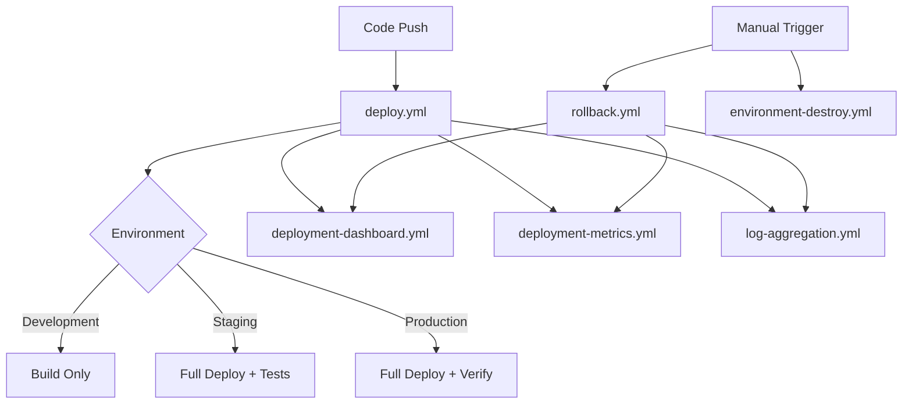

# GitHub Actions Workflows

This directory contains the simplified, unified CI/CD pipeline for the DotCA project. The pipeline has been consolidated from 7+ complex workflows into a streamlined, maintainable system.

## 🏗️ Simplified Architecture

The new architecture follows a **single unified deployment workflow** with supporting monitoring and maintenance workflows:

```
Code Changes → Unified Deploy Workflow → Environment Deployment
                ↓
        Testing & Health Checks
                ↓
        Monitoring & Notifications
```

## 📋 Core Workflows

### 🚀 Unified Deployment (`deploy.yml`)

**Purpose**: Single workflow handling all deployments across environments

- **Triggers**: Branch pushes (`main`, `staging`, `renovations`), manual dispatch
- **Key Features**:
  - Automatic environment detection based on branch
  - Integrated testing (unit, integration, E2E)
  - Docker build and multi-architecture support
  - Infrastructure provisioning (Terraform)
  - Application deployment (Ansible)
  - Comprehensive health verification
  - Environment-specific configurations

**Environment Mapping:**

- `renovations` → Development (build-only)
- `staging` → Staging (full deployment + testing)
- `main` → Production (full deployment + verification)

### 🔄 Rollback System (`rollback.yml`)

**Purpose**: Emergency rollback capabilities for failed deployments

- **Triggers**: Manual dispatch, automatic (future enhancement)
- **Key Features**:
  - Safety checks before rollback execution
  - Environment-specific rollback logic
  - Automatic health verification post-rollback
  - Comprehensive rollback reporting
  - Notification integration

### 📊 Monitoring & Analytics

#### `deployment-dashboard.yml`

**Purpose**: Deployment status monitoring and basic dashboard

- **Triggers**: Post-deployment, manual refresh
- **Features**: Environment status tracking, deployment history

#### `deployment-metrics.yml`

**Purpose**: Collect and analyze deployment metrics

- **Triggers**: Post-deployment, scheduled daily
- **Features**: Success rates, deployment times, environment metrics

#### `log-aggregation.yml`

**Purpose**: Aggregate and analyze deployment logs

- **Triggers**: Post-deployment, scheduled cleanup
- **Features**: Log collection, error pattern analysis, cleanup

### 🛠️ Maintenance Workflows

#### `docker-build.yml`

**Purpose**: Standalone Docker image building

- **Triggers**: Code changes, manual dispatch
- **Features**: Multi-architecture builds, GHCR publishing

#### `dependency-check.yml`

**Purpose**: Dependency security scanning

- **Features**: CVE scanning, security vulnerability reports

#### `image-cleanup.yml`

**Purpose**: Clean up old Docker images

- **Features**: Automated cleanup, retention policies

#### `image-history-tracking.yml`

**Purpose**: Track image promotion history

- **Features**: Audit trails, version tracking

#### `environment-destroy.yml`

**Purpose**: Safely destroy environments

- **Features**: Resource cleanup, safety confirmations

## 🔧 Reusable Actions

Located in `.github/actions/` for modular functionality:

### `test-runner/`

- **Purpose**: Unified test execution across all test types
- **Supports**: Unit, integration, E2E, and smoke tests
- **Features**: Environment-aware, configurable timeouts, artifact collection

### `deploy/`

- **Purpose**: Application deployment logic
- **Features**: Infrastructure setup, app deployment, health verification

### `health-check/`

- **Purpose**: Comprehensive health verification
- **Features**: HTTP checks, performance validation, security scanning

### `notify/`

- **Purpose**: Multi-channel notifications
- **Channels**: GitHub, Slack, Teams, Email

## 🔐 Security & Environments

### GitHub Environments

Environment-specific configurations in `.github/workflows/environments/`:

- `development.yml` - Development build settings
- `staging.yml` - Staging deployment configuration
- `production.yml` - Production deployment with maximum security

### Required Secrets

- `DO_TOKEN` - DigitalOcean API access
- `SSH_PRIVATE_KEY` - Server access key
- `SSH_KEY_FINGERPRINT` - SSH key fingerprint
- `SPACES_ACCESS_ID/SECRET_KEY` - Object storage
- `BREVO_API_KEY` - Email service
- `STRIPE_SECRET_KEY` - Payment processing
- `ANSIBLE_VAULT_PASSWORD` - Ansible secrets
- `GITHUB_TOKEN` - GitHub API access

### Security Features

- Environment-specific secret scoping
- Branch protection rules
- Manual approval requirements for production
- Comprehensive audit logging

## 🔐 Security & Permissions

### Required Secrets

- `DO_TOKEN`: DigitalOcean API token
- `SSH_PRIVATE_KEY`: SSH key for server access
- `SSH_KEY_FINGERPRINT`: SSH key fingerprint
- `SPACES_ACCESS_ID`/`SPACES_SECRET_KEY`: DigitalOcean Spaces
- `BREVO_API_KEY`: Email service
- `STRIPE_SECRET_KEY`/`NEXT_PUBLIC_STRIPE_PUBLISHABLE_KEY`: Payment processing
- `NEXT_PUBLIC_PRODUCTION_GA_ID`: Google Analytics

### GitHub Environments

- **production-promotion**: Requires manual approval for image promotion
- Environment protection rules enforce manual reviews for production changes

## 📊 Workflow Dependencies



## 🚦 Workflow States & Triggers

| Workflow                 | Automatic | Manual | Branch-based                  | Scheduled  |
| ------------------------ | --------- | ------ | ----------------------------- | ---------- |
| deploy.yml               | ✅        | ✅     | ✅ (main/staging/renovations) | ❌         |
| rollback.yml             | ❌        | ✅     | ❌                            | ❌         |
| deployment-dashboard.yml | ✅        | ✅     | ❌                            | ❌         |
| deployment-metrics.yml   | ✅        | ❌     | ❌                            | ✅ (daily) |
| log-aggregation.yml      | ✅        | ✅     | ❌                            | ✅ (daily) |
| docker-build.yml         | ✅        | ✅     | ✅ (main/staging)             | ❌         |
| dependency-check.yml     | ❌        | ✅     | ❌                            | ❌         |

## 🎯 Usage Guidelines

### For Development

1. **Feature Development**: Work on `renovations` branch
2. **Automatic Testing**: Push to `renovations` triggers unit tests and build validation
3. **No Deployment**: Development branch only validates builds, no actual deployment

### For Staging Deployment

1. **Merge to Staging**: Push/merge to `staging` branch
2. **Automatic Deployment**: Triggers full staging deployment with comprehensive testing
3. **E2E Testing**: Includes integration and E2E tests
4. **Health Verification**: Automatic health checks post-deployment

### For Production Deployment

1. **Merge to Main**: Push/merge to `main` branch triggers automatic production deployment
2. **Security Gates**: Requires approval through GitHub environment protection
3. **Full Verification**: Includes health checks, smoke tests, and monitoring
4. **Rollback Ready**: Automatic rollback capability on failures

### For Emergency Situations

1. **Rollback**: Use `rollback.yml` to rollback to previous stable version
2. **Environment Issues**: Use `environment-destroy.yml` for infrastructure recreation
3. **Health Checks**: Built into deployment workflow, or use manual health verification

## 🔧 Customization

### Adding New Environments

1. Add new environment configuration in `.github/workflows/environments/`
2. Update branch detection logic in `deploy.yml`
3. Configure GitHub environment with appropriate secrets and protection rules
4. Test deployment in new environment

### Modifying Deployment Flow

1. Update reusable actions in `.github/actions/`
2. Modify environment configurations as needed
3. Test changes in staging environment first
4. Update monitoring and notification logic

## 📈 Monitoring & Troubleshooting

### Common Issues

- **Permission Errors**: Check GitHub environment secrets and permissions
- **Deployment Failures**: Review workflow logs and health check results
- **Environment Detection**: Verify branch names match expected patterns
- **Infrastructure Issues**: Check Terraform/Ansible configurations

### Best Practices

- Always test changes in staging before production
- Monitor deployment dashboard for status updates
- Use manual dispatch for emergency deployments when needed
- Keep environment configurations updated
- Regularly review deployment metrics

### Health Check Endpoints

- **Production**: https://boximity.ca/api/health
- **Staging**: https://staging.boximity.ca/api/health
- **Development**: Build validation only

## 📚 Related Documentation

- [CI/CD Architecture](../../docs/ci-cd-architecture.md)
- [Environment Configuration](./environments/README.md)
- [Infrastructure Setup](../../terraform/README.md)
- [Ansible Playbooks](../../ansible/README.md)

---

**Note**: This documentation reflects the simplified, unified CI/CD pipeline. The old complex multi-workflow system has been replaced with a single maintainable deployment workflow.
