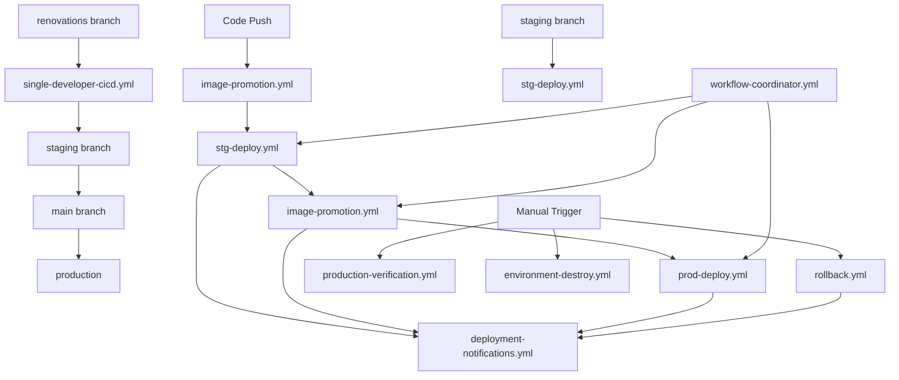

# GitHub Actions Workflows

This directory contains all GitHub Actions workflows for the DotCA project. These workflows manage the complete CI/CD pipeline from code changes to production deployment, including testing, building, deployment, and monitoring.

## 🏗️ Workflow Architecture

The workflows are designed with a **staged deployment pipeline** that follows this flow:

```
Code Changes → Build → QA → Staging → Image Promotion → Production
                ↓
            Notifications & Monitoring
```

## 📋 Core Workflows

### 🎯 Single Developer Workflows

#### `single-developer-cicd.yml`

**Purpose**: Streamlined CI/CD pipeline optimized for single developer workflow

- **Triggers**: Push to `renovations`, `staging`, `main` branches, PRs, manual dispatch
- **Branch Flow**: `renovations` → `staging` → `main` (production)
- **Key Features**:
  - Automatic builds and tests on all branches
  - Auto-deploy to staging when pushing to staging branch
  - Manual promotion to production with approval
  - Simplified workflow replacing complex multi-workflow setup
  - Maintains safety with tests, linting, and manual production approval

### 🔨 Build & CI Workflows

#### `image-promotion.yml`

**Purpose**: Builds staging images and promotes them to production with validation

- **Triggers**: Manual dispatch, staging deployment completion
- **Outputs**: Promoted Docker images in GHCR
- **Key Features**:
  - Smart path filtering (only builds when code changes)
  - Multi-architecture builds
  - Automatic tagging based on branch/commit
  - Security scanning with Trivy
  - Image promotion workflow with manual approval

#### `image-promotion.yml`

**Purpose**: Builds staging images and promotes them to production with validation

- **Triggers**: Manual dispatch, staging deployment completion
- **Features**:
  - Runs comprehensive test suite
  - Code quality checks (linting, formatting)
  - Unit and integration tests
  - Test coverage reporting
  - Image promotion workflow with manual approval

### 🚀 Deployment Workflows

#### `stg-deploy.yml`

**Purpose**: Staging environment deployment pipeline

- **Triggers**: Push to `staging` branch, manual dispatch
- **Infrastructure**: DigitalOcean droplet managed by Terraform
- **Key Features**:
  - Infrastructure as Code (Terraform)
  - Ansible-based application deployment
  - Automatic SSL certificate management
  - Health checks and verification
  - Selenium end-to-end testing

#### `prod-deploy.yml`

**Purpose**: Production deployment using promoted images

- **Triggers**: Manual dispatch, called by image promotion workflow
- **Security**: Requires promoted/tested images only
- **Key Features**:
  - Infrastructure provisioning/updates
  - Blue-green deployment strategy
  - Comprehensive health verification
  - Performance testing
  - Security checks
  - Automated rollback on failure

#### `image-promotion.yml`

**Purpose**: Promotes staging images to production with manual approval

- **Triggers**: Manual dispatch only
- **Security**: Requires manual approval via GitHub environments
- **Key Features**:
  - Image validation and integrity checks
  - Security vulnerability scanning
  - Manual approval gate for production
  - Automatic production deployment trigger
  - Comprehensive audit logging

### 🔄 Management Workflows

#### `rollback.yml`

**Purpose**: Emergency rollback to previous production version

- **Triggers**: Manual dispatch only
- **Key Features**:
  - Rollback to any tagged version
  - Safety confirmations required
  - Automatic health verification
  - Incident documentation
  - Team notifications

#### `environment-destroy.yml`

**Purpose**: Safely destroy staging or production environments

- **Triggers**: Manual dispatch with confirmation
- **Safety**: Requires typed confirmation to prevent accidents
- **Features**:
  - Terraform state cleanup
  - Resource verification
  - Cost optimization

#### `environment-destroy.yml`

**Purpose**: Clean up staging or production environment resources

- **Triggers**: Manual dispatch with confirmation
- **Purpose**: Resource cleanup and cost management

### 📊 Monitoring & Coordination

#### `deployment-notifications.yml`

**Purpose**: Centralized notification system for all deployments

- **Type**: Reusable workflow (called by others)
- **Channels**: GitHub, Slack, Teams, Email
- **Events**: Deployment start/success/failure, promotions, rollbacks

#### `production-verification.yml`

**Purpose**: Standalone production health verification

- **Triggers**: Manual dispatch, scheduled (optional)
- **Checks**: Health, performance, security verification
- **Use Cases**: Post-deployment verification, routine health checks

#### `workflow-coordinator.yml`

**Purpose**: Validates workflow dependencies and sequencing

- **Features**:
  - Dependency validation
  - Workflow readiness checks
  - Sequence recommendations

#### `deployment-status-dashboard.yml`

**Purpose**: Generates deployment status dashboards and reports

- **Features**: Visual status tracking, historical reports

#### `image-history-tracking.yml`

**Purpose**: Tracks and maintains image promotion history

- **Features**: Audit trail, version tracking, compliance reporting

#### `dependency-check.yml`

**Purpose**: Security vulnerability scanning for dependencies

- **Features**: CVE scanning, security reporting

## 🔐 Security & Permissions

### Required Secrets

- `DO_TOKEN`: DigitalOcean API token
- `SSH_PRIVATE_KEY`: SSH key for server access
- `SSH_KEY_FINGERPRINT`: SSH key fingerprint
- `SPACES_ACCESS_ID`/`SPACES_SECRET_KEY`: DigitalOcean Spaces
- `BREVO_API_KEY`: Email service
- `STRIPE_SECRET_KEY`/`NEXT_PUBLIC_STRIPE_PUBLISHABLE_KEY`: Payment processing
- `NEXT_PUBLIC_PRODUCTION_GA_ID`: Google Analytics

### GitHub Environments

- **production-promotion**: Requires manual approval for image promotion
- Environment protection rules enforce manual reviews for production changes

## 📊 Workflow Dependencies



## 🚦 Workflow States & Triggers

| Workflow                | Automatic | Manual | Branch-based | Scheduled     |
| ----------------------- | --------- | ------ | ------------ | ------------- |
| single-developer-cicd   | ✅        | ✅     | ✅ (all)     | ❌            |
| image-promotion         | ✅        | ❌     | ✅           | ❌            |
| stg-deploy              | ✅        | ✅     | ✅ (staging) | ❌            |
| image-promotion         | ❌        | ✅     | ❌           | ❌            |
| prod-deploy             | ❌        | ✅     | ❌           | ❌            |
| rollback                | ❌        | ✅     | ❌           | ❌            |
| production-verification | ❌        | ✅     | ❌           | ⚠️ (optional) |
| environment-destroy     | ❌        | ✅     | ❌           | ❌            |

## 🎯 Usage Guidelines

### For Development

#### Single Developer Workflow (Recommended)

1. **Development**: Work on `renovations` branch, create PRs for Renovate updates
2. **Testing**: Merge to `staging` branch for automatic staging deployment
3. **Production**: Merge to `main` branch for production deployment (requires approval)

#### Multi-Developer Workflow (Advanced)

1. **Feature Development**: Work on feature branches, create PRs to `main`
2. **QA Testing**: Merge to `qa` branch to trigger QA pipeline
3. **Staging Testing**: Merge to `staging` branch for staging deployment

### For Production Deployment

1. **Image Promotion**: Manually trigger `image-promotion.yml` with staging image tag
2. **Manual Approval**: Approve promotion in GitHub environment protection
3. **Automatic Deployment**: Production deployment triggers automatically after promotion
4. **Verification**: Monitor deployment health and run additional verification if needed

### For Emergency Situations

1. **Rollback**: Use `rollback.yml` with specific rollback target
2. **Environment Issues**: Use `environment-destroy.yml` if infrastructure needs recreation
3. **Health Checks**: Use `production-verification.yml` for standalone health verification

## 🔧 Customization

### Adding New Environments

1. Create new deployment workflow (copy from `stg-deploy.yml`)
2. Update Terraform configuration for new environment
3. Add notification channels to `deployment-notifications.yml`
4. Update `workflow-coordinator.yml` dependencies

### Modifying Deployment Flow

1. Update workflow dependencies in respective files
2. Modify notification events in `deployment-notifications.yml`
3. Update image promotion workflow if needed
4. Test changes in staging environment first

## 📈 Monitoring & Troubleshooting

### Common Issues

- **Permission Errors**: Check secrets and GitHub environment settings
- **Deployment Failures**: Review logs in failed workflow runs
- **Image Issues**: Verify images exist in GHCR before promotion
- **Infrastructure Issues**: Check DigitalOcean resources and Terraform state

### Best Practices

- Always test changes in staging before production
- Use manual approval for production changes
- Monitor deployment notifications
- Keep secrets up to date
- Regularly verify production health

## 📚 Related Documentation

- [Deployment Guide](../../docs/DEPLOYMENT_GHCR.md)
- [Infrastructure Setup](../../terraform/README.md)
- [Ansible Playbooks](../../ansible/README.md)

---

**Note**: This is a living document. Update it when adding or modifying workflows to keep the team informed of changes.
