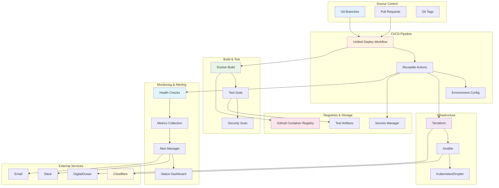
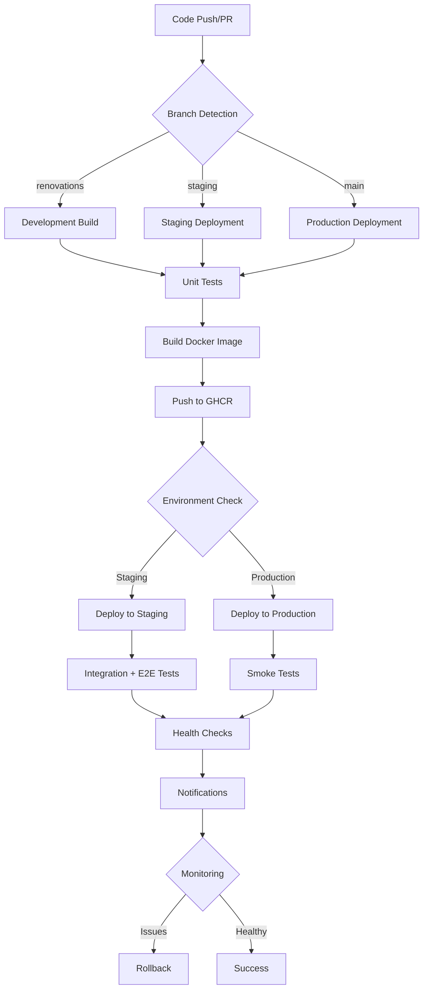
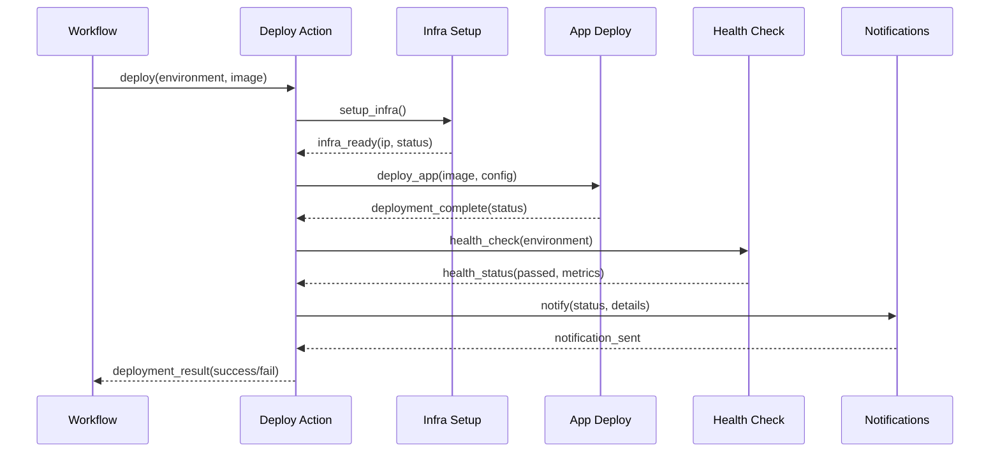
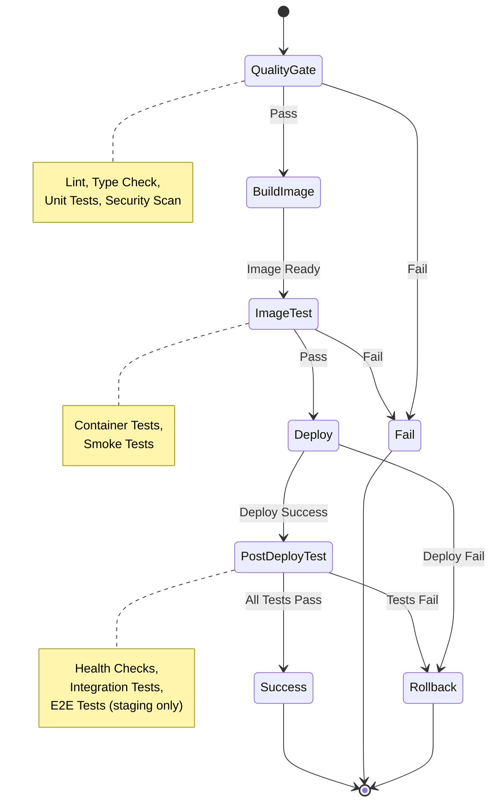
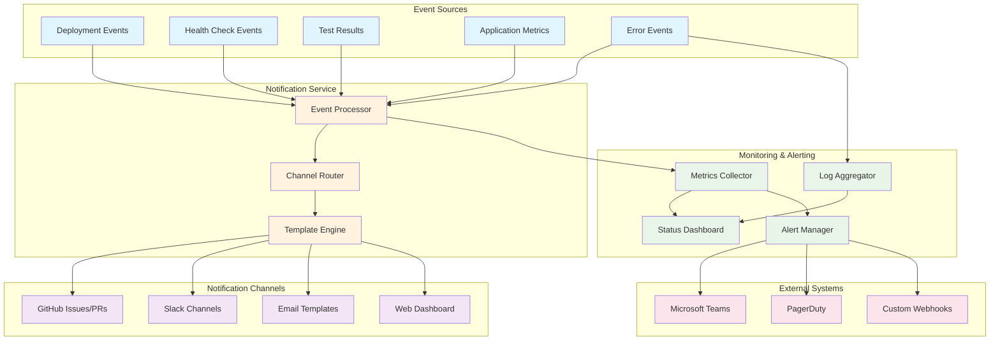

# CI/CD Pipeline Architecture

## Current State Analysis

### Workflow Complexity Issues

The current CI/CD pipeline consists of multiple large workflows totaling over 5000 lines of YAML:

- **prod-deploy.yml**: 1277 lines - Production deployment with manual Cloudflare proxy management
- **image-promotion.yml**: 2153+ lines - Complex promotion workflow with extensive error handling
- **stg-deploy.yml**: 717+ lines - Staging deployment workflow
- **workflow-coordinator.yml**: Coordination logic between workflows
- **docker-build.yml**: Image building workflow
- Multiple supporting workflows (notifications, rollback, cleanup, etc.)

### Key Complexity Problems

1. **Manual Intervention Requirements**
   - Cloudflare proxy toggling requires manual steps before/after deployment
   - Manual approval gates for production promotion
   - Manual environment-specific configuration

2. **Duplicated Infrastructure Logic**
   - Terraform setup duplicated across staging/production workflows
   - SSH key management repeated in multiple places
   - Ansible deployment logic scattered across workflows

3. **Complex Error Handling**
   - Extensive custom error handling utilities (200+ lines)
   - Multiple retry mechanisms with exponential backoff
   - Complex logging and auditing systems

4. **Maintenance Overhead**
   - Changes require updates across multiple workflow files
   - Testing workflows require separate maintenance
   - Environment-specific logic scattered across files

## Simplified Pipeline Architecture

### Core Principles

1. **Single Unified Workflow**: Consolidate all deployment logic into one maintainable `deploy.yml` workflow
2. **Branch-Based Automation**: Automatic environment detection based on branch names
3. **Automated Everything**: Eliminate all manual intervention points
4. **Reusable Components**: Common deployment steps extracted into reusable actions

### Branch-to-Environment Mapping Strategy

The simplified pipeline uses a clear, automated branch-to-environment mapping strategy:

#### Branch Definitions

| Branch        | Environment | Purpose                         | Deployment Behavior                     |
| ------------- | ----------- | ------------------------------- | --------------------------------------- |
| `renovations` | Development | Feature development and testing | Build-only, unit tests only             |
| `staging`     | Staging     | UAT and integration testing     | Full deployment + comprehensive testing |
| `main`        | Production  | Live production environment     | Full deployment + health verification   |

#### Automation Rules

**Environment Detection Logic:**

```yaml
environment: ${{ github.ref == 'refs/heads/main' && 'production' || github.ref == 'refs/heads/staging' && 'staging' || 'development' }}
```

**Deployment Triggers:**

- `renovations`: Push/PR events → Build and unit test only
- `staging`: Push events → Full staging deployment with all tests
- `main`: Push events → Production deployment with verification

**Testing Levels by Environment:**

- **Development**: Unit tests, linting, security scanning
- **Staging**: All development tests + integration tests + E2E tests
- **Production**: All staging tests + smoke tests + health verification

#### Branch Protection Strategy

**Staging Branch (`staging`):**

- Require pull request reviews
- Require status checks (build, unit tests)
- Restrict pushes to maintainers
- Require up-to-date branches

**Main Branch (`main`):**

- Require pull request reviews
- Require status checks (build, tests, staging deployment success)
- Require branch to be up-to-date
- Restrict pushes to release managers
- Require manual approval for critical changes

#### Deployment Flow

```
Feature Branch → PR to staging → Staging tests pass → PR to main → Production deployment
     ↓              ↓                     ↓              ↓              ↓
  Local dev      Staging deploy       E2E tests       Prod deploy    Health checks
  Unit tests     Integration tests    Manual QA       Smoke tests    Monitoring
```

### Overall Pipeline Component Diagram



### Detailed Workflow Structure



### Environment Configuration Class Diagram

```mermaid
classDiagram
    class Environment {
        +name: string
        +url: string
        +secrets: Secret[]
        +variables: Variable[]
        +protection_rules: ProtectionRule
    }

    class Secret {
        +name: string
        +type: string
        +required: boolean
        +environment: string
    }

    class Variable {
        +name: string
        +value: string
        +description: string
    }

    class ProtectionRule {
        +required_reviewers: number
        +required_checks: string[]
        +restrict_pushes: boolean
    }

    Environment ||--o{ Secret
    Environment ||--o{ Variable
    Environment ||--|| ProtectionRule
```

### Deployment Action Sequence Diagram



### Environment-Specific Configuration Management

The simplified pipeline leverages GitHub's built-in environment management features for secure, organized configuration:

#### GitHub Environments Structure

**Environment Definitions:**

```
.github/
└── workflows/
    └── environments/
        ├── staging.yml
        ├── production.yml
        └── development.yml (optional)
```

**Environment Files Content:**

```yaml
# .github/workflows/environments/staging.yml
name: staging
url: https://staging.boximity.ca
branches:
  - staging
protection_rules:
  required_reviewers: 1
  required_checks:
    - build
    - test
secrets:
  - DO_TOKEN
  - SSH_PRIVATE_KEY
  - DATABASE_URL_STAGING
variables:
  ENVIRONMENT: staging
  APP_URL: https://staging.boximity.ca
  DEBUG: true
```

#### Configuration Categories

**1. Secrets Management**

- **Per-Environment Secrets**: Database credentials, API keys, service tokens
- **Shared Secrets**: Docker registry credentials, SSH keys
- **Automatic Rotation**: Integration with secret management services

**2. Environment Variables**

- **Application Config**: URLs, feature flags, logging levels
- **Infrastructure Config**: Resource sizes, scaling parameters
- **Deployment Config**: Health check endpoints, timeouts

**3. Infrastructure Configuration**

- **Terraform Variables**: Instance sizes, region settings
- **Ansible Variables**: Application settings, service configurations
- **Network Config**: Firewall rules, load balancer settings

#### Configuration Loading Strategy

**Runtime Configuration Loading:**

```yaml
jobs:
  deploy:
    environment: ${{ github.ref == 'refs/heads/main' && 'production' || 'staging' }}
    steps:
      - name: Load environment config
        run: |
          # Load environment-specific variables
          echo "APP_URL=${{ vars.APP_URL }}" >> $GITHUB_ENV
          echo "ENVIRONMENT=${{ vars.ENVIRONMENT }}" >> $GITHUB_ENV

      - name: Deploy with config
        uses: ./.github/actions/deploy
        with:
          environment: ${{ env.ENVIRONMENT }}
          app_url: ${{ env.APP_URL }}
        env:
          DATABASE_URL: ${{ secrets.DATABASE_URL }}
```

#### Configuration Validation

**Pre-Deployment Validation:**

- Schema validation for configuration files
- Secret existence verification
- Environment variable format checking
- Cross-reference validation between configs

**Runtime Validation:**

- Configuration loading confirmation
- Secret decryption verification
- Environment variable accessibility checks

### Reusable Action Structure

The simplified pipeline uses GitHub's composite actions to create reusable, maintainable deployment components:

#### Action Organization Structure

```
.github/
└── actions/
    ├── deploy/
    │   ├── action.yml          # Main deployment action
    │   ├── Dockerfile          # Optional: custom tooling
    │   └── test.sh            # Testing script
    ├── health-check/
    │   ├── action.yml          # Health verification
    │   └── health-tests.sh     # Health check logic
    ├── test-runner/
    │   ├── action.yml          # Test orchestration
    │   ├── unit-tests.sh       # Unit test runner
    │   ├── integration-tests.sh # Integration tests
    │   └── e2e-tests.sh        # E2E test runner
    └── notify/
        ├── action.yml          # Notification system
        └── templates/          # Notification templates
```

#### Core Actions Design

**1. Deploy Action (`.github/actions/deploy/action.yml`)**

```yaml
name: "Deploy Application"
description: "Unified deployment action for all environments"

inputs:
  environment:
    description: "Target environment (staging|production)"
    required: true
  image_tag:
    description: "Docker image tag to deploy"
    required: true
  skip_tests:
    description: "Skip tests for emergency deployments"
    default: "false"
  force_rebuild:
    description: "Force infrastructure rebuild"
    default: "false"

outputs:
  deployment_status:
    description: "Deployment result (success|failed)"
  droplet_ip:
    description: "Deployed droplet IP address"
  health_check_passed:
    description: "Health verification result"

runs:
  using: "composite"
  steps:
    - name: Setup infrastructure
      uses: ./.github/actions/setup-infra
      with:
        environment: ${{ inputs.environment }}
        force_rebuild: ${{ inputs.force_rebuild }}

    - name: Deploy application
      uses: ./.github/actions/deploy-app
      with:
        environment: ${{ inputs.environment }}
        image_tag: ${{ inputs.image_tag }}

    - name: Run health checks
      uses: ./.github/actions/health-check
      with:
        environment: ${{ inputs.environment }}
        skip_tests: ${{ inputs.skip_tests }}
```

**2. Health Check Action (`.github/actions/health-check/action.yml`)**

```yaml
name: "Health Check"
description: "Comprehensive health verification"

inputs:
  environment:
    description: "Target environment"
    required: true
  app_url:
    description: "Application URL to test"
    required: true
  skip_performance:
    description: "Skip performance tests"
    default: "false"

outputs:
  status:
    description: "Health check result"
  response_time:
    description: "Average response time"
  error_count:
    description: "Number of errors detected"

runs:
  using: "composite"
  steps:
    - name: HTTP connectivity check
      run: |
        curl -f --max-time 30 ${{ inputs.app_url }}/api/health
      shell: bash

    - name: Performance validation
      if: inputs.skip_performance != 'true'
      run: |
        # Performance testing logic
      shell: bash

    - name: Security scan
      run: |
        # Basic security checks
      shell: bash
```

**3. Test Runner Action (`.github/actions/test-runner/action.yml`)**

```yaml
name: "Test Runner"
description: "Orchestrate testing across environments"

inputs:
  environment:
    description: "Target environment"
    required: true
  test_types:
    description: "Comma-separated test types (unit,integration,e2e)"
    default: "unit,integration"
  app_url:
    description: "Application URL for integration tests"
  fail_fast:
    description: "Stop on first test failure"
    default: "false"

outputs:
  test_results:
    description: "JSON test results summary"
  coverage:
    description: "Test coverage percentage"
  failed_tests:
    description: "Number of failed tests"

runs:
  using: "composite"
  steps:
    - name: Setup test environment
      run: |
        npm ci
        npm run build
      shell: bash

    - name: Run unit tests
      if: contains(inputs.test_types, 'unit')
      run: npm run test:unit
      shell: bash

    - name: Run integration tests
      if: contains(inputs.test_types, 'integration')
      run: npm run test:integration
      shell: bash
      env:
        APP_URL: ${{ inputs.app_url }}

    - name: Run E2E tests
      if: contains(inputs.test_types, 'e2e')
      run: npm run test:e2e
      shell: bash
      env:
        APP_URL: ${{ inputs.app_url }}
```

#### Supporting Actions

**4. Infrastructure Setup Action**

- Terraform initialization and planning
- Resource provisioning
- SSH key configuration
- Network setup

**5. Notification Action**

- Slack notifications
- GitHub issues/PR comments
- Email alerts
- Status dashboard updates

**6. Rollback Action**

- Previous version identification
- Image reversion
- Database rollback (if needed)
- Health verification after rollback

#### Action Design Principles

**1. Single Responsibility**
Each action has one clear purpose and minimal inputs/outputs.

**2. Environment Agnostic**
Actions work across all environments with configuration parameters.

**3. Idempotent Operations**
Actions can be safely re-run without side effects.

**4. Comprehensive Error Handling**
Actions provide clear error messages and failure reasons.

**5. Testable Components**
Each action includes testing and validation logic.

### Testing Workflow Integration Diagram



### Testing Integration Strategy

The simplified pipeline integrates testing at multiple levels with environment-specific test execution:

#### Test Types and Environments

| Test Type             | Development | Staging         | Production      | Purpose                 |
| --------------------- | ----------- | --------------- | --------------- | ----------------------- |
| **Unit Tests**        | ✅ Always   | ✅ Always       | ✅ Always       | Code correctness        |
| **Integration Tests** | ❌          | ✅ Always       | ✅ Always       | Component interaction   |
| **E2E Tests**         | ❌          | ✅ Always       | ❌              | User journey validation |
| **Performance Tests** | ❌          | ✅ Optional     | ❌              | Load and performance    |
| **Security Tests**    | ✅ Basic    | ✅ Full         | ❌              | Security validation     |
| **Smoke Tests**       | ❌          | ✅ After deploy | ✅ After deploy | Basic functionality     |

#### Environment-Specific Testing Configuration

**Development Environment (renovations branch):**

```yaml
# Fast feedback loop for developers
test_config:
  unit_tests:
    enabled: true
    fail_fast: false
    coverage_required: 80%
  integration_tests:
    enabled: false # Too slow for dev feedback
  security_scan:
    enabled: true
    level: basic # Quick SAST scan
```

**Staging Environment (staging branch):**

```yaml
# Comprehensive testing before production
test_config:
  unit_tests:
    enabled: true
    coverage_required: 90%
  integration_tests:
    enabled: true
    api_endpoints: true
    database_tests: true
  e2e_tests:
    enabled: true
    browsers: [chromium, firefox]
    test_scenarios: full_suite
  performance_tests:
    enabled: true
    concurrent_users: 50
    duration_minutes: 5
  security_scan:
    enabled: true
    level: comprehensive
```

**Production Environment (main branch):**

```yaml
# Minimal but critical validation
test_config:
  unit_tests:
    enabled: true
    smoke_test_only: true # Quick validation
  integration_tests:
    enabled: true
    critical_paths_only: true
  smoke_tests:
    enabled: true
    endpoints:
      - /api/health
      - /
      - /api/user (if authenticated)
  security_scan:
    enabled: false # Don't impact production
```

#### Test Execution Integration Points

**1. Pre-Build Testing (Quality Gate)**

```yaml
# Runs before Docker build to fail fast
- name: Quality checks
  run: |
    npm run lint
    npm run type-check
    npm run test:unit -- --coverage --passWithNoTests
```

**2. Post-Build Testing (Image Validation)**

```yaml
# Test the built image before deployment
- name: Test container image
  run: |
    docker run --rm ${{ env.IMAGE_NAME }} npm run test:unit
```

**3. Pre-Deployment Testing (Environment Readiness)**

```yaml
# Ensure target environment is ready
- name: Environment smoke tests
  run: |
    # Check infrastructure health
    # Validate configuration
    # Test connectivity
```

**4. Post-Deployment Testing (Validation)**

```yaml
# Comprehensive validation after deployment
- name: Deployment verification
  uses: ./.github/actions/health-check
  with:
    environment: ${{ env.ENVIRONMENT }}
    run_full_tests: true
```

#### Test Result Aggregation and Reporting

**Unified Test Reporting:**

- **JUnit XML**: Standardized test output format
- **Coverage Reports**: Code coverage visualization
- **Test Analytics**: Historical trends and metrics
- **Failure Analysis**: Automated root cause detection

**Notification Integration:**

- **Test Failures**: Immediate alerts with failure details
- **Coverage Drops**: Warnings when coverage decreases
- **Performance Regressions**: Alerts for performance degradation
- **Security Issues**: Critical alerts for security vulnerabilities

#### Test Data Management

**Environment-Specific Test Data:**

- **Development**: Mock data and test fixtures
- **Staging**: Sanitized production-like data
- **Production**: No test data creation (read-only testing)

**Test Database Strategy:**

- **Ephemeral Databases**: Fresh database for each test run
- **Data Seeding**: Consistent test data across environments
- **Cleanup**: Automatic cleanup after test completion

#### Parallel Test Execution

**Test Parallelization Strategy:**

```yaml
# Distribute tests across multiple runners
- name: Run tests in parallel
  uses: ./.github/actions/test-runner
  with:
    parallel: true
    shard_count: 4
    shard_index: ${{ strategy.job-index }}
```

**Benefits:**

- Faster feedback loops
- Better resource utilization
- Scalable test execution

#### Test Failure Handling

**Failure Recovery Strategies:**

1. **Retry Logic**: Automatic retry for flaky tests
2. **Quarantine**: Move failing tests to quarantine suite
3. **Root Cause Analysis**: Automated failure categorization
4. **Blocker Detection**: Identify tests blocking deployment

**Deployment Impact:**

- **Soft Failures**: Tests that don't block deployment but create issues
- **Hard Failures**: Critical tests that prevent deployment
- **Conditional Deployment**: Allow deployment with known issues in emergencies

### Notification System

Unified notification strategy:

- **Start**: Deployment initiated
- **Success**: Deployment completed successfully
- **Failure**: Deployment failed with details
- **Channels**: GitHub notifications, Slack, email

### Notification and Monitoring Component Diagram



**Component Descriptions:**

**Event Sources:**

- **Deployment Events**: Start, success, failure, rollback events
- **Health Check Events**: Application health status changes
- **Test Results**: Test suite outcomes and coverage metrics
- **Application Metrics**: Performance, error rates, response times
- **Error Events**: Exceptions, timeouts, system failures

**Notification Service:**

- **Event Processor**: Filters, enriches, and categorizes events
- **Channel Router**: Determines appropriate notification channels per event type
- **Template Engine**: Formats messages using environment-specific templates

**Notification Channels:**

- **GitHub Issues/PRs**: Deployment status updates and failure reports
- **Slack Channels**: Real-time alerts and team notifications
- **Email Templates**: Formal notifications for stakeholders
- **Web Dashboard**: Visual status display and historical data

**Monitoring & Alerting:**

- **Status Dashboard**: Real-time deployment and system health overview
- **Alert Manager**: Escalation logic and alert routing
- **Metrics Collector**: Performance and reliability metrics aggregation
- **Log Aggregator**: Centralized logging and analysis

### Rollback Strategy Design

The simplified pipeline includes comprehensive rollback capabilities to ensure system reliability and minimize downtime:

#### Rollback Triggers

**Automatic Rollback Triggers:**

- Health check failures (HTTP 5xx errors, application crashes)
- Deployment verification failures (after multiple retries)
- Critical security vulnerabilities detected post-deployment
- Performance degradation (response time > threshold)

**Manual Rollback Triggers:**

- Emergency rollback via workflow dispatch
- Administrative decision based on monitoring alerts
- User-reported critical issues

#### Rollback Implementation Strategy

**1. Version Management**

```
Image Tagging Strategy:
├── latest (always points to current deployment)
├── stable (always points to last known good deployment)
├── v2024-12-29-001 (timestamp-based tags)
├── main-abc1234 (git commit-based tags)
└── rollback-pending (temporary tag during rollback)
```

**2. Rollback Execution Flow**

```yaml
name: Rollback Deployment

on:
  workflow_dispatch:
    inputs:
      environment:
        description: "Environment to rollback"
        required: true
        options: [staging, production]
      reason:
        description: "Reason for rollback"
        required: true

jobs:
  rollback:
    runs-on: ubuntu-latest
    environment: ${{ inputs.environment }}

    steps:
      - name: Identify rollback target
        run: |
          # Find last stable deployment
          STABLE_TAG=$(get_last_stable_tag ${{ inputs.environment }})

      - name: Execute rollback
        uses: ./.github/actions/rollback
        with:
          environment: ${{ inputs.environment }}
          target_image: ${{ env.STABLE_TAG }}
          reason: ${{ inputs.reason }}

      - name: Verify rollback success
        uses: ./.github/actions/health-check
        with:
          environment: ${{ inputs.environment }}
          rollback_verification: true
```

#### Rollback Action Design

**Rollback Action Structure:**

```yaml
# .github/actions/rollback/action.yml
name: "Rollback Deployment"
description: "Rollback to previous stable version"

inputs:
  environment:
    description: "Target environment"
    required: true
  target_image:
    description: "Image tag to rollback to"
    required: true
  reason:
    description: "Reason for rollback"
    required: true
  skip_health_checks:
    description: "Skip health checks during rollback"
    default: "false"

runs:
  using: "composite"
  steps:
    - name: Create rollback snapshot
      run: |
        # Backup current state before rollback
        create_deployment_snapshot ${{ inputs.environment }}

    - name: Deploy previous version
      uses: ./.github/actions/deploy
      with:
        environment: ${{ inputs.environment }}
        image_tag: ${{ inputs.target_image }}
        rollback_mode: true

    - name: Update stable tag
      run: |
        # Update stable tag to point to rollback target
        update_stable_tag ${{ inputs.target_image }}

    - name: Verify rollback
      if: inputs.skip_health_checks != 'true'
      uses: ./.github/actions/health-check
      with:
        environment: ${{ inputs.environment }}
        rollback_verification: true
```

#### Rollback Safety Mechanisms

**1. Pre-Rollback Validation**

- Verify target image exists and is accessible
- Check image integrity (digest validation)
- Ensure rollback target is different from current deployment
- Validate environment configuration compatibility

**2. Rollback Testing**

- Health checks on rollback target before execution
- Smoke tests to verify basic functionality
- Performance validation to ensure acceptable response times

**3. Rollback Monitoring**

- Real-time monitoring during rollback execution
- Automatic failure detection and recovery
- Detailed logging of rollback process
- Performance metrics collection

#### Rollback Scope and Impact

**Environment-Specific Rollback Behavior:**

**Staging Environment:**

- Automatic rollback on test failures
- Fast rollback execution (minimal validation)
- No user impact (internal testing environment)

**Production Environment:**

- Manual approval required for rollback
- Comprehensive validation before rollback
- User communication and status page updates
- Gradual rollout with canary deployment option

#### Rollback Recovery Strategies

**1. Partial Rollback**

- Rollback specific services/components
- Maintain other services at current version
- Useful for microservice architectures

**2. Gradual Rollback**

- Percentage-based rollout (10% → 25% → 50% → 100%)
- Monitor metrics at each stage
- Automatic rollback if thresholds exceeded

**3. Emergency Rollback**

- Immediate full rollback to last known good state
- Minimal validation for speed
- Used only for critical system failures

#### Post-Rollback Actions

**1. Incident Analysis**

- Automatic creation of incident report
- Root cause analysis triggers
- Deployment freeze consideration

**2. Communication**

- Stakeholder notifications
- Status page updates
- User communication if affected

**3. Prevention**

- Update deployment safeguards
- Review and improve testing
- Update monitoring thresholds

#### Rollback Metrics and Monitoring

**Key Metrics Tracked:**

- Rollback frequency and success rate
- Mean time to rollback (MTTR)
- Rollback impact duration
- False positive rollback rate

**Monitoring Integration:**

- Rollback events in deployment dashboard
- Automated alerting for rollback patterns
- Trend analysis for rollback causes

## Implementation Roadmap

### Phase 1: Architecture Foundation

- [ ] Create unified `deploy.yml` workflow structure
- [ ] Implement branch-based environment detection
- [ ] Set up environment-specific configurations
- [ ] Create basic reusable actions framework

### Phase 2: Core Deployment Logic

- [ ] Implement Docker build and push logic
- [ ] Add infrastructure provisioning (Terraform)
- [ ] Integrate application deployment (Ansible)
- [ ] Add basic health checks

### Phase 3: Testing and Verification

- [ ] Implement testing integration
- [ ] Add comprehensive health verification
- [ ] Create notification system
- [ ] Implement rollback capabilities

### Phase 4: Migration and Cleanup

- [ ] Migrate existing deployments to new pipeline
- [ ] Update documentation and training
- [ ] Remove obsolete workflows
- [ ] Monitor and optimize performance

## Success Metrics

- **Deployment Time**: Reduce from hours to minutes
- **Failure Rate**: Reduce deployment failures by 50%
- **Maintenance Time**: Reduce pipeline maintenance by 70%
- **Code Complexity**: Reduce from 5000+ lines to <500 lines
- **Manual Steps**: Eliminate all manual intervention requirements
