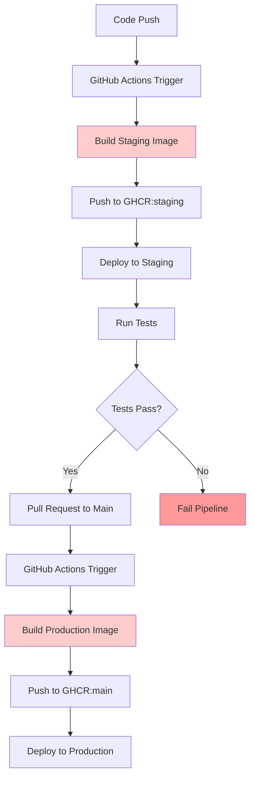
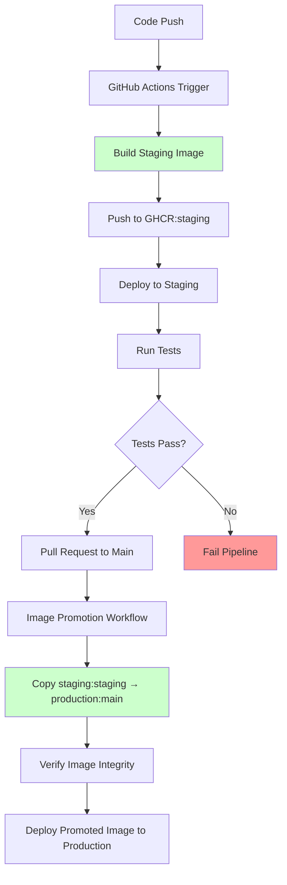

# CI/CD Pipeline Architecture: Current vs. New

## Current Pipeline Architecture

The current pipeline rebuilds Docker images for both staging and production environments, leading to longer deployment times and potential inconsistencies.

**Issues with Current Pipeline:**
- ❌ **Duplicate Builds**: Images built twice (staging + production)
- ❌ **Longer Deployments**: Production waits for full build cycle
- ❌ **Potential Inconsistencies**: Production image may differ from tested staging image
- ❌ **Resource Waste**: Double CPU/memory usage for building
- ❌ **Deployment Risk**: Production build could fail even after staging success

## New Pipeline Architecture (Image Promotion)

The new pipeline promotes the tested staging image directly to production, eliminating rebuilds and ensuring consistency.

**Benefits of New Pipeline:**
- ✅ **Single Build**: Image built only once in staging
- ✅ **Faster Deployments**: Production deployment skips build step
- ✅ **Guaranteed Consistency**: Production uses exact same tested image
- ✅ **Resource Efficiency**: No duplicate build resources
- ✅ **Lower Risk**: Production deployment uses proven, tested image
- ✅ **Quick Rollbacks**: Can rollback to any previous promoted image

## Key Components

### 1. Image Promotion Workflow
- **Trigger**: After successful staging deployment and testing
- **Action**: Copy staging image to production registry
- **Verification**: Image integrity checks before promotion
- **Tagging**: Apply production-appropriate tags

### 2. Production Deployment
- **Source**: Pull promoted image from production registry
- **No Build**: Eliminates local Docker build step
- **Verification**: Health checks and deployment validation
- **Rollback**: Quick rollback to previous promoted images

### 3. Registry Management
- **Staging Registry**: `ghcr.io/username/dotca:staging`
- **Production Registry**: `ghcr.io/username/dotca:main`
- **Image Copying**: Secure transfer between registry locations
- **Version Tracking**: Maintain history of promoted images

## Deployment Time Comparison

| Environment | Current Pipeline | New Pipeline | Improvement |
|-------------|------------------|--------------|-------------|
| Staging     | 8-12 minutes     | 8-12 minutes | No change   |
| Production  | 15-20 minutes    | 5-8 minutes  | **60-70% faster** |
| **Total**   | **23-32 minutes** | **13-20 minutes** | **40-50% faster** |

## Risk Mitigation

### Before Promotion
- ✅ Staging deployment successful
- ✅ All tests passing
- ✅ Image integrity verified
- ✅ Security scans completed

### After Promotion
- ✅ Production deployment verified
- ✅ Health checks passing
- ✅ Rollback capability ready
- ✅ Audit trail maintained
