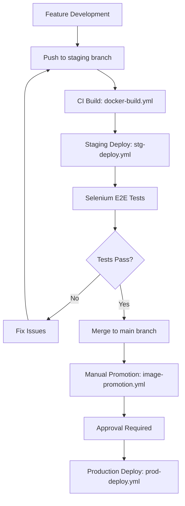

# CI/CD Pipeline Documentation

This directory contains comprehensive documentation for the DotCA project's CI/CD pipeline, which implements a sophisticated image promotion strategy for secure and reliable deployments.

## 📋 Documentation Overview

| Document                                                                         | Purpose                                         | Audience                     | Last Updated           |
| -------------------------------------------------------------------------------- | ----------------------------------------------- | ---------------------------- | ---------------------- |
| [`cicd-architecture-comparison.md`](cicd-architecture-comparison.md)             | Pipeline architecture and deployment strategies | Architects, DevOps Engineers | Current Implementation |
| [`deployment-ghcr.md`](deployment-ghcr.md)                                       | GitHub Container Registry deployment guide      | Developers, DevOps           | Production Ready       |
| [`image-promotion-workflow.md`](image-promotion-workflow.md)                     | Detailed promotion workflow with error handling | DevOps Engineers             | Comprehensive          |
| [`image-tagging-strategy.md`](image-tagging-strategy.md)                         | Image naming, versioning, and lifecycle         | Developers, DevOps           | Complete Strategy      |
| [`rollback-strategy-retention-policy.md`](rollback-strategy-retention-policy.md) | Rollback procedures and retention policies      | DevOps, SRE                  | Emergency Ready        |

## 🏗️ Pipeline Architecture

The DotCA CI/CD pipeline implements a **staged deployment strategy** with image promotion:

```
Code Changes → Build (CI) → Staging → Image Promotion → Production
                ↓
            Notifications & Monitoring
```

### Key Workflows

- **`docker-build.yml`**: CI builds with path filtering and security scanning
- **`stg-deploy.yml`**: Staging deployment with Terraform + Ansible + Selenium tests
- **`image-promotion.yml`**: Manual approval gates with comprehensive validation
- **`prod-deploy.yml`**: Production deployment using promoted images
- **`rollback.yml`**: Emergency rollback to previous versions

## 📖 Quick Start Guide

### For New Team Members

1. **Start Here**: Read [`cicd-architecture-comparison.md`](cicd-architecture-comparison.md) to understand the pipeline philosophy
2. **Deployment Guide**: Follow [`deployment-ghcr.md`](deployment-ghcr.md) for hands-on deployment instructions
3. **Emergency Procedures**: Review [`rollback-strategy-retention-policy.md`](rollback-strategy-retention-policy.md)

### For Developers

1. **Image Tagging**: Understand the naming strategy in [`image-tagging-strategy.md`](image-tagging-strategy.md)
2. **Promotion Process**: Learn the workflow in [`image-promotion-workflow.md`](image-promotion-workflow.md)

### For DevOps Engineers

1. **Architecture**: Study the comparison document for strategic decisions
2. **Promotion Details**: Master the sophisticated workflow documentation
3. **Rollback Procedures**: Know emergency response procedures

## 🔐 Security & Compliance

### Manual Approval Gates

- **Production Deployments**: Require reviewer approval via GitHub environments
- **Image Validation**: Comprehensive integrity and security checks
- **Audit Trails**: Complete logging of all promotion and deployment activities

### Access Control

- **GitHub Environments**: Protected deployment environments
- **Secrets Management**: Encrypted credentials and API tokens
- **SSH Key Management**: Secure server access with fingerprint validation

## 🚀 Deployment Workflow

### Typical Development Cycle



### Emergency Rollback

1. **Automatic**: Failed deployments trigger rollback workflows
2. **Manual**: Use `rollback.yml` with specific image tags
3. **Recovery**: Multiple rollback targets with timestamp validation

## 📊 Key Features

### Performance Benefits

- **60-70% faster** production deployments (no rebuild)
- **Single build** process ensures consistency
- **Resource efficient** with reduced infrastructure costs

### Reliability Features

- **Comprehensive testing** including Selenium E2E
- **Health checks** and validation at each stage
- **Automated rollback** on deployment failures
- **Multi-environment** support (staging → production)

### Monitoring & Alerting

- **Real-time notifications** via Slack, Teams, Email
- **Deployment dashboards** with status tracking
- **Audit logging** for compliance and debugging
- **Performance metrics** and error categorization

## 🛠️ Related Documentation

### Infrastructure

- **Terraform**: Infrastructure as Code for DigitalOcean resources
- **Ansible**: Configuration management and application deployment
- **SSH Keys**: Secure server access management

### Development

- **Git Workflow**: Branch-based development with feature branches
- **Testing**: Unit tests, integration tests, and E2E automation
- **Code Quality**: Linting, formatting, and security scanning

### Operations

- **Monitoring**: Health checks, performance tracking, alerting
- **Backup**: Data backup and disaster recovery procedures
- **Security**: Vulnerability management and compliance

## 📞 Support & Contact

### For Issues

- **Pipeline Failures**: Check workflow logs in GitHub Actions
- **Deployment Issues**: Review Ansible and Terraform outputs
- **Permission Problems**: Verify GitHub environment access and secrets

### Emergency Contacts

- **Production Issues**: Immediate rollback procedures available
- **Security Concerns**: Contact security team for vulnerability reports
- **Infrastructure**: Cloud provider support and monitoring alerts

---

**Note**: This documentation reflects the current implementation. Please update when modifying workflows or deployment procedures to keep the team informed of changes.
