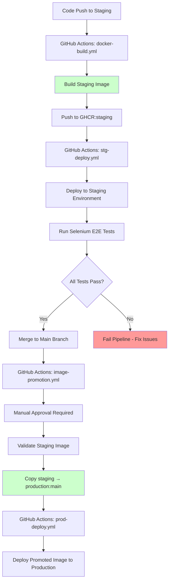
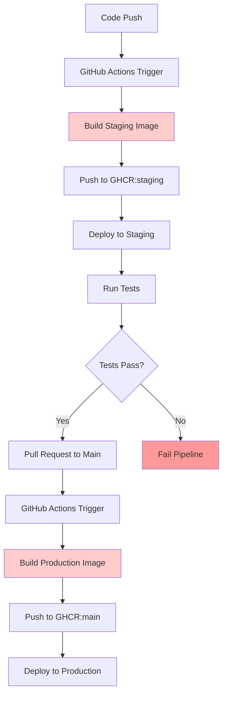

# CI/CD Pipeline Architecture: Current Implementation vs Traditional Approach

## Current Pipeline Architecture (Image Promotion)

The current pipeline implements a sophisticated **image promotion strategy** where Docker images are built once in staging, thoroughly tested, and then promoted to production, ensuring complete consistency between tested and deployed code.

**Key Features of Current Pipeline:**

- ✅ **Single Build Process**: Docker image built once, tested thoroughly, then promoted
- ✅ **Manual Approval Gates**: Production deployments require explicit reviewer approval
- ✅ **Comprehensive Testing**: Selenium E2E tests + health checks before promotion
- ✅ **Image Validation**: Integrity checks, security scanning, and metadata validation
- ✅ **Audit Trail**: Complete logging of promotions, deployments, and rollbacks
- ✅ **Error Recovery**: Sophisticated error handling with automatic retries
- ✅ **Rollback Safety**: Multiple rollback targets with timestamped tags

## Traditional Pipeline Architecture (Dual Builds)

For comparison, here's how a traditional dual-build pipeline would work:

**Issues with Traditional Dual-Build Approach:**

- ❌ **Duplicate Builds**: Same code built twice (staging + production)
- ❌ **Longer Deployments**: Production waits for full build cycle (~8-12 minutes)
- ❌ **Potential Inconsistencies**: Production image may differ from tested staging image
- ❌ **Resource Waste**: Double CPU/memory usage for building
- ❌ **Higher Risk**: Production build could fail even after staging success

## Key Components

### 1. Build & CI Workflow (`docker-build.yml`)

- **Trigger**: Push to `main`/`staging` branches, path-filtered for efficiency
- **Build Process**: Multi-architecture Docker builds with security scanning
- **Registry**: Pushes to GitHub Container Registry (GHCR)
- **Tagging**: Branch-based and commit-specific tags

### 2. Staging Deployment (`stg-deploy.yml`)

- **Trigger**: Push to `staging` branch or manual dispatch
- **Infrastructure**: Terraform-managed DigitalOcean droplets
- **Deployment**: Ansible-based configuration management
- **Testing**: Selenium end-to-end tests + health verification
- **SSL**: Automated certificate management

### 3. Image Promotion Workflow (`image-promotion.yml`)

- **Trigger**: Manual dispatch with staging image tag input
- **Security**: Requires manual approval via GitHub environment protection
- **Validation**: Comprehensive image integrity, size, and metadata checks
- **Promotion**: Secure image copy from staging to production registry
- **Audit**: Complete logging and compliance tracking

### 4. Production Deployment (`prod-deploy.yml`)

- **Trigger**: Manual dispatch or automatic after image promotion
- **Strategy**: Blue-green deployment with health verification
- **Rollback**: Automatic rollback on deployment failures
- **Monitoring**: Real-time health checks and performance validation

### 5. Management Workflows

- **Rollback** (`rollback.yml`): Emergency rollback to previous versions
- **Environment Management**: Safe destruction and cleanup workflows
- **Notifications**: Centralized alerting via Slack/Teams/Email
- **Monitoring**: Deployment status dashboards and health verification

## Deployment Time Comparison

| Phase                     | Current Image Promotion Pipeline    | Traditional Dual-Build Pipeline | Improvement         |
| ------------------------- | ----------------------------------- | ------------------------------- | ------------------- |
| **Build (CI)**            | 3-5 minutes (path-filtered)         | 3-5 minutes                     | No change           |
| **Staging Deploy**        | 5-8 minutes (Terraform + Ansible)   | 5-8 minutes                     | No change           |
| **Testing**               | 2-3 minutes (Selenium E2E)          | 2-3 minutes                     | No change           |
| **Image Promotion**       | 1-2 minutes (validation + approval) | N/A (no promotion step)         | **New safety step** |
| **Production Deploy**     | 2-4 minutes (promoted image)        | 8-12 minutes (full rebuild)     | **60-70% faster**   |
| **Total Deployment Time** | **13-22 minutes**                   | **18-28 minutes**               | **25-35% faster**   |

## Security & Risk Mitigation

### Pre-Promotion Validation

- ✅ **Staging Deployment**: Successful infrastructure provisioning and deployment
- ✅ **End-to-End Testing**: Selenium tests verify application functionality
- ✅ **Health Checks**: Application and infrastructure health verification
- ✅ **Image Integrity**: Size, layers, metadata, and signature validation
- ✅ **Security Scanning**: Vulnerability scanning (when Trivy available)
- ✅ **Manual Approval**: Required reviewer approval for production access

### Post-Promotion Safeguards

- ✅ **Deployment Verification**: Automated health checks and service validation
- ✅ **Performance Monitoring**: Response time and resource usage tracking
- ✅ **Rollback Readiness**: Multiple rollback targets with automated procedures
- ✅ **Audit Trail**: Complete logging of all promotion and deployment actions
- ✅ **Error Recovery**: Sophisticated error handling with categorized logging

### Additional Security Features

- ✅ **GitHub Environment Protection**: Required reviewers for production deployments
- ✅ **Registry Security**: Private GHCR packages with controlled access
- ✅ **Infrastructure as Code**: Terraform-managed infrastructure with state locking
- ✅ **Secrets Management**: GitHub secrets with restricted access
- ✅ **Network Security**: SSH key management and firewall configuration
