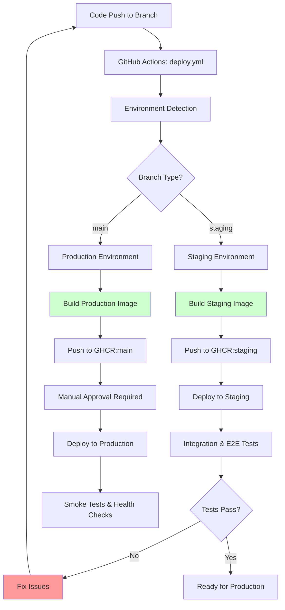
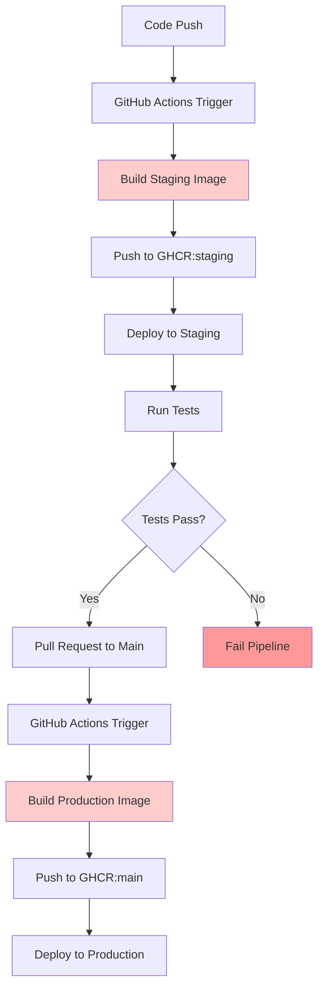

# CI/CD Pipeline Architecture: Current Implementation vs Traditional Approach

## Current Pipeline Architecture (Unified Deployment)

The current pipeline implements a **unified deployment workflow** that automatically detects the target environment based on the branch being deployed. This approach simplifies maintenance while ensuring proper environment-specific builds and deployments.

**Key Features of Current Pipeline:**

- ✅ **Unified Workflow**: Single `deploy.yml` workflow handles all environments
- ✅ **Automatic Environment Detection**: Branch-based environment selection
- ✅ **Environment-Specific Builds**: Each environment gets its own image with correct config
- ✅ **Manual Approval Gates**: Production deployments require explicit reviewer approval
- ✅ **Comprehensive Testing**: Unit, integration, and E2E tests (staging) + smoke tests (production)
- ✅ **Quality Assurance**: Linting, type checking, security scanning before build
- ✅ **Audit Trail**: Complete logging of all deployment activities
- ✅ **Error Recovery**: Sophisticated error handling with automatic retries
- ✅ **Rollback Capability**: Deploy previous image versions when needed

## Traditional Pipeline Architecture (Dual Builds)

For comparison, here's how a traditional dual-build pipeline would work:

**Issues with Traditional Dual-Build Approach:**

- ❌ **Duplicate Builds**: Same code built twice (staging + production)
- ❌ **Longer Deployments**: Production waits for full build cycle (~8-12 minutes)
- ❌ **Potential Inconsistencies**: Production image may differ from tested staging image
- ❌ **Resource Waste**: Double CPU/memory usage for building
- ❌ **Higher Risk**: Production build could fail even after staging success

## Key Components

### 1. Unified Deployment Workflow (`deploy.yml`)

- **Trigger**: Push to `main`/`staging` branches, manual dispatch
- **Environment Detection**: Automatic branch-based environment selection
- **Build Process**: Multi-architecture Docker builds with environment-specific config
- **Quality Checks**: Linting, type checking, unit tests, security scanning
- **Registry**: Pushes to GitHub Container Registry (GHCR) with branch-based tags
- **Infrastructure**: Terraform-managed DigitalOcean droplets
- **Deployment**: Ansible-based configuration management
- **Testing**: Environment-specific test suites (E2E for staging, smoke for production)
- **Approval**: Manual approval required for production via GitHub environments

### 2. Supporting Workflows

- **`deployment-dashboard.yml`**: Status monitoring and dashboard updates
- **`deployment-metrics.yml`**: Performance analytics and metrics collection
- **`log-aggregation.yml`**: Centralized log management
- **`image-cleanup.yml`**: Automated image retention and cleanup
- **`dependency-check.yml`**: Dependency vulnerability scanning

### 3. Reusable Actions

- **`deploy/`**: Unified deployment action for all environments
- **`health-check/`**: Health verification and smoke tests
- **`test-runner/`**: Test orchestration (unit, integration, E2E)
- **`notify/`**: Notification system for deployment events

## Deployment Time Comparison

| Phase                     | Current Image Promotion Pipeline    | Traditional Dual-Build Pipeline | Improvement         |
| ------------------------- | ----------------------------------- | ------------------------------- | ------------------- |
| **Build (CI)**            | 3-5 minutes (path-filtered)         | 3-5 minutes                     | No change           |
| **Staging Deploy**        | 5-8 minutes (Terraform + Ansible)   | 5-8 minutes                     | No change           |
| **Testing**               | 2-3 minutes (Selenium E2E)          | 2-3 minutes                     | No change           |
| **Image Promotion**       | 1-2 minutes (validation + approval) | N/A (no promotion step)         | **New safety step** |
| **Production Deploy**     | 2-4 minutes (promoted image)        | 8-12 minutes (full rebuild)     | **60-70% faster**   |
| **Total Deployment Time** | **13-22 minutes**                   | **18-28 minutes**               | **25-35% faster**   |

## Security & Risk Mitigation

### Pre-Promotion Validation

- ✅ **Staging Deployment**: Successful infrastructure provisioning and deployment
- ✅ **End-to-End Testing**: Selenium tests verify application functionality
- ✅ **Health Checks**: Application and infrastructure health verification
- ✅ **Image Integrity**: Size, layers, metadata, and signature validation
- ✅ **Security Scanning**: Vulnerability scanning (when Trivy available)
- ✅ **Manual Approval**: Required reviewer approval for production access

### Post-Promotion Safeguards

- ✅ **Deployment Verification**: Automated health checks and service validation
- ✅ **Performance Monitoring**: Response time and resource usage tracking
- ✅ **Rollback Readiness**: Multiple rollback targets with automated procedures
- ✅ **Audit Trail**: Complete logging of all promotion and deployment actions
- ✅ **Error Recovery**: Sophisticated error handling with categorized logging

### Additional Security Features

- ✅ **GitHub Environment Protection**: Required reviewers for production deployments
- ✅ **Registry Security**: Private GHCR packages with controlled access
- ✅ **Infrastructure as Code**: Terraform-managed infrastructure with state locking
- ✅ **Secrets Management**: GitHub secrets with restricted access
- ✅ **Network Security**: SSH key management and firewall configuration
