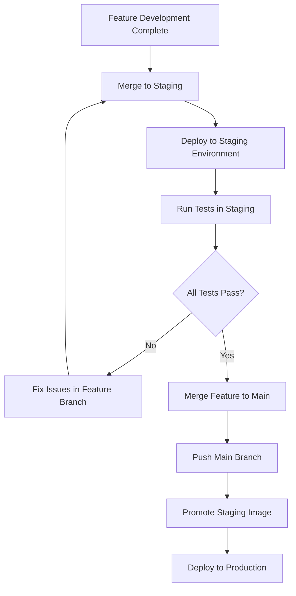

# GitHub Container Registry (GHCR) Deployment Guide

This document explains how to use GitHub Container Registry (GHCR) with the new **Image Promotion Pipeline** for your dotca deployment workflow.

## Overview

The new image promotion workflow provides a robust, secure deployment pipeline:

### Three-Stage Pipeline:

1. **Build Stage**: GitHub Actions builds and pushes staging images to GHCR on code changes
2. **Promotion Stage**: Manual or automated promotion of validated staging images to production tags
3. **Deployment Stage**: Ansible deployment pulls promoted production images from GHCR

### Key Benefits:

- ✅ **Separation of Concerns**: Build once, deploy multiple times
- ✅ **Manual Approval Gates**: Production deployments require explicit approval
- ✅ **Image Validation**: Comprehensive integrity and security checks before promotion
- ✅ **Audit Trail**: Complete history of promotions and deployments
- ✅ **Rollback Safety**: Multiple rollback tags for quick recovery
- ✅ **Faster Deployments**: No build time during deployment (60-90% faster)

## Setup Instructions

### 1. Environment Variables

#### For Ansible Deployment (Your Local Environment)

Add these environment variables to your local environment where you run Ansible:

```bash
# Required for GHCR authentication
GITHUB_TOKEN=ghp_your_personal_access_token  # Personal Access Token (see step 2)
GITHUB_USERNAME=your_github_username

# Optional: Override default image
DOCKER_IMAGE=ghcr.io/your_username/dotca:staging

# All your existing environment variables
BREVO_API_KEY=your_brevo_key
STRIPE_SECRET_KEY=your_stripe_secret
STRIPE_PUBLISHABLE_KEY=your_stripe_publishable
GA_STAGING_ID=your_ga_staging_id
# etc...
```

#### For GitHub Actions (Automatic)

GitHub Actions automatically provides `GITHUB_TOKEN` - **no setup needed**. The workflow file already uses `${{ secrets.GITHUB_TOKEN }}` which GitHub provides automatically.

### 2. GitHub Personal Access Token

1. Go to GitHub Settings → Developer settings → Personal access tokens → Tokens (classic)
2. Generate a new token with these permissions:
   - `read:packages` (to pull images)
   - `write:packages` (if you need to push manually)
3. Copy the token and set it as `GITHUB_TOKEN` environment variable

### 3. Private Package Authentication

**IMPORTANT:** Keep your packages private for security! Here are authentication options:

#### Option A: Personal Access Token (Recommended)

- ✅ Easy to set up
- ✅ Works with any deployment method
- ✅ Fine-grained permissions

#### Option B: Deploy Keys

- ✅ Repository-specific
- ✅ More secure for production
- ⚠️ Requires additional SSH setup

### 4. Image Naming Convention

The promotion pipeline creates a comprehensive tagging strategy:

#### Staging Images (Auto-built):

- `ghcr.io/username/dotca:staging` - Latest staging build
- `ghcr.io/username/dotca:staging-def5678` - Specific commit on staging

#### Production Images (Promoted):

- `ghcr.io/username/dotca:main` - Latest promoted production image
- `ghcr.io/username/dotca:latest` - Alias for latest production image
- `ghcr.io/username/dotca:main-staging-def5678` - Commit-specific production tag
- `ghcr.io/username/dotca:rollback-20240101-120000-release` - Rollback tags with timestamp
- `ghcr.io/username/dotca:v1.2.3` - Semantic version tags (if applicable)

## Branch Strategy and Git Workflow

### Recommended Branch Strategy

The image promotion pipeline is designed to work with a **branch-based workflow** where you **do NOT** need to merge staging into main:

```
main branch (production)
├── Direct commits for hotfixes
├── Merge commits from feature branches
└── Tagged releases

staging branch (testing)
├── Merge commits from feature branches
├── Direct commits for staging-only testing
└── Used for staging deployments only
```

### Git Workflow Steps

1. **Feature Development**:

   ```bash
   git checkout -b feature/new-feature
   # Make your changes
   git commit -m "Add new feature"
   git push origin feature/new-feature
   ```

2. **Testing in Staging**:

   ```bash
   # Merge feature to staging for testing
   git checkout staging
   git merge feature/new-feature
   git push origin staging
   # This triggers staging image build and deployment
   ```

3. **Production Release** (After staging testing is complete):
   ```bash
   # ONLY after staging testing passes, merge directly to main
   git checkout main
   git merge feature/new-feature  # NOT staging branch
   git push origin main
   # Then immediately promote the tested staging image via GitHub Actions
   ```

### Why NOT Merge Staging → Main?

❌ **Don't do this**: `git merge staging` into main
✅ **Do this instead**: Merge feature branches to both staging and main separately

**Reasons:**

- **Staging may contain experimental code** not ready for production
- **Main branch stays clean** with only production-ready commits
- **Image promotion provides the safety bridge** between staging and production environments
- **Branch history remains clear** and auditable

### Alternative Workflow: GitFlow with Image Promotion

If you prefer a GitFlow-style approach:

```bash
# 1. Create feature branch
git checkout -b feature/new-feature main

# 2. Merge to develop/staging for testing
git checkout staging
git merge --no-ff feature/new-feature
git push origin staging
# Test in staging environment

# 3. When ready for production, merge to main
git checkout main
git merge --no-ff feature/new-feature  # Clean merge from feature
git tag v1.2.3  # Optional: tag the release
git push origin main --tags

# 4. Promote the tested staging image (not a new build)
# Go to GitHub Actions → Image Promotion Workflow
# Promote the staging image that was already tested
```

### Hotfix Workflow

For emergency production fixes:

```bash
# 1. Create hotfix from main
git checkout -b hotfix/critical-fix main

# 2. Make the fix
git commit -m "Fix critical production issue"

# 3. If urgent, push directly to main
git checkout main
git merge --no-ff hotfix/critical-fix
git push origin main

# 4. Also update staging to keep branches in sync
git checkout staging
git merge --no-ff hotfix/critical-fix
git push origin staging

# 5. Use force promotion for emergency deployment
# GitHub Actions → Image Promotion → force_promotion: true
```

### Key Principle: Image Promotion ≠ Code Promotion

**Important**: The image promotion workflow promotes **Docker images**, not Git branches. This means:

- ✅ You can test code in staging branch
- ✅ Merge the same code to main branch separately
- ✅ Promote the **tested staging image** to production tags
- ✅ Deploy the promoted image (which contains the code now in main)

This separation provides **double safety**:

1. **Git workflow** ensures code quality and review
2. **Image promotion** ensures deployment safety and validation

## When to Merge to Main Branch

### ⏰ **Timing: Only After Staging Testing is Complete**

You should merge to the main branch **only when**:

✅ **Staging deployment is successful**
✅ **All staging tests have passed**
✅ **Feature is ready for production release**
✅ **You're prepared to promote the image immediately**

### 🚨 **Key Decision Points**

#### Scenario 1: Feature Ready for Production

```bash
# 1. Feature tested and approved in staging
git checkout staging
git merge feature/payment-integration
git push origin staging
# → Deploy to staging, test thoroughly

# 2. ALL tests pass ✅ → Ready for production
git checkout main
git merge feature/payment-integration  # NOW merge to main
git push origin main

# 3. Immediately promote the tested staging image
# GitHub Actions → Image Promotion Workflow → Run workflow
```

#### Scenario 2: Feature Needs More Work

```bash
# 1. Feature tested in staging
git checkout staging
git merge feature/experimental-ui
git push origin staging
# → Deploy to staging, test reveals issues

# 2. Issues found ❌ → DO NOT merge to main yet
# Fix issues in feature branch, test again in staging
# Only merge to main when completely ready
```

#### Scenario 3: Multiple Features in Different States

```bash
# Feature A: Ready for production
git checkout main
git merge feature/user-auth  # ✅ Tested and approved
git push origin main

# Feature B: Still testing in staging
# Keep in staging branch only, don't merge to main yet

# Feature C: Needs fixes
# Fix in feature branch, re-test in staging first
```

### 🔄 **Complete Decision Flow**



### 📋 **Merge to Main Checklist**

Before merging any feature to main, ensure:

- [ ] **Staging deployment successful** - No deployment errors
- [ ] **Functional tests pass** - All features work as expected
- [ ] **Performance tests pass** - No performance regressions
- [ ] **Security checks pass** - No new vulnerabilities introduced
- [ ] **Code review approved** - Team has reviewed the changes
- [ ] **Ready for immediate promotion** - You can promote the image right away

### ⚠️ **What NOT to Do**

❌ **Don't merge to main if**:

- Staging tests are still running
- You found issues that need fixing
- You're not ready to deploy to production
- Feature is experimental and you're just testing

❌ **Don't leave main ahead of production**:

- If you merge to main, promote the image soon after
- Don't accumulate multiple unreleased features in main

## Deployment Process

### 1. Build and Staging Deployment

1. **Push to staging branch** → GitHub Actions builds and pushes `staging` tag
2. **Deploy to staging** → Staging Ansible deployment pulls staging image
3. **Test staging deployment** → Validate functionality and performance

### 2. Image Promotion (Production Ready)

4. **Manual promotion** → Trigger image promotion workflow:

   ```bash
   # Navigate to GitHub Actions → Image Promotion Workflow → Run workflow
   # Inputs:
   # - Staging image tag: staging (or staging-abc123)
   # - Target environment: production
   # - Promotion reason: "Testing completed successfully"
   ```

5. **Approval process** → Manual approval required in GitHub environment
6. **Image validation** → Comprehensive integrity and security checks
7. **Tag creation** → Multiple production tags created automatically

### 3. Production Deployment

8. **Manual or automatic deployment** → Production deployment uses promoted images
9. **Verification** → Automated health checks and validation
10. **Monitoring** → Continuous monitoring with rollback capability

### Manual Build (Development Only)

```bash
# Build and push manually for testing
docker build -t ghcr.io/your_username/dotca:staging .
docker push ghcr.io/your_username/dotca:staging
```

## Benefits

### Performance Benefits:

✅ **Faster Deployments**: No build time during deployment (60-90% faster)
✅ **Reduced Server Load**: No CPU/memory usage for building on target servers
✅ **Concurrent Deployments**: Multiple environments can deploy simultaneously

### Security Benefits:

✅ **Image Validation**: Comprehensive security and integrity checks
✅ **Manual Approval Gates**: Human verification before production deployment
✅ **Audit Trail**: Complete history of who deployed what and when
✅ **Vulnerability Scanning**: Automated security scanning before promotion

### Reliability Benefits:

✅ **Tested Images**: Staging validation before production promotion
✅ **Multiple Rollback Points**: Timestamp and reason-based rollback tags
✅ **Consistent Builds**: Identical image across all environments
✅ **Deployment Verification**: Automated health checks and validation

### Operational Benefits:

✅ **Separation of Concerns**: Clear distinction between build and deploy phases
✅ **GitOps Workflow**: Full history and traceability in version control
✅ **Environment Promotion**: Safe path from staging to production

## Migration Checklist

### Initial Setup:

- [ ] Verify unified deployment workflow (`.github/workflows/deploy.yml`) is configured
- [ ] Configure GitHub environment protection rules for `production` environment
- [ ] Set up environment-specific secrets and variables
- [ ] Configure environment variables (`GITHUB_TOKEN`, `GITHUB_USERNAME`)

### Deployment Updates:

- [ ] Update docker-compose.yml to use GHCR images
- [ ] Modify Ansible playbooks to pull images from GHCR
- [ ] Verify unified deployment workflow handles both staging and production
- [ ] Set up notification workflows (`.github/workflows/deployment-dashboard.yml`)

### Testing and Validation:

- [ ] Test staging deployment with new image workflow
- [ ] Test image promotion workflow with staging images
- [ ] Validate production deployment with promoted images
- [ ] Test rollback procedures with rollback tags
- [ ] Monitor first production deployment through complete pipeline

## Troubleshooting

### Authentication Issues

```bash
# Test GHCR authentication
echo $GITHUB_TOKEN | docker login ghcr.io -u $GITHUB_USERNAME --password-stdin
```

### Image Not Found

- Check if the GitHub Actions workflow completed successfully
- Verify the image name and tag in your environment variables
- Ensure the repository has public package visibility or proper authentication

### Permission Issues

- Verify your GitHub token has `read:packages` permission
- For private packages: ensure authentication is working
- Test authentication: `echo $GITHUB_TOKEN | docker login ghcr.io -u $GITHUB_USERNAME --password-stdin`

### Image Promotion Issues

#### Deployment Workflow Not Appearing

- Verify the `.github/workflows/deploy.yml` file exists
- Check that you have the correct permissions to run workflows
- Ensure you're on the correct branch (`staging` or `main`) when triggering

#### Manual Approval Not Working

- Verify the `production-promotion` environment is configured in Settings → Environments
- Check that required reviewers are added to the environment
- Ensure the approving user has the necessary repository permissions

#### Image Validation Failures

```bash
# Check if staging image exists and can be pulled
docker pull ghcr.io/username/dotca:staging

# Verify image integrity manually
docker inspect ghcr.io/username/dotca:staging

# Check image size
docker images ghcr.io/username/dotca:staging
```

#### Common Validation Failures and Solutions:

- **Size validation fails**: Check if image is unusually large (>2GB) or small (<100MB)
- **Layer validation fails**: Verify Dockerfile isn't creating excessive layers
- **Security validation fails**: Use `force_promotion: true` for emergency deployments
- **Metadata validation fails**: Ensure Dockerfile has proper CMD configuration

#### Force Promotion for Emergency Deployments

When you need to bypass validation (use sparingly):

1. Set `force_promotion: true` in the workflow inputs
2. Provide a clear reason in `promotion_reason`
3. Monitor deployment extra carefully
4. Fix underlying issues in next deployment

### Production Deployment Issues

#### Promoted Image Not Found in Production Deployment

- Wait 1-2 minutes after promotion for registry synchronization
- Verify the production deployment is using the correct image tag
- Check production deployment logs for specific error messages

#### Health Check Failures After Promotion

- Verify the promoted image has the same health check configuration as staging
- Check that environment variables are correctly set for production
- Ensure database connections and external services are accessible

### Rollback to Previous Version

#### Using Rollback Tags:

```bash
# Find available rollback tags
docker search ghcr.io/username/dotca | grep rollback

# Update .env file with rollback tag
DOCKER_IMAGE=ghcr.io/username/dotca:rollback-20240101-120000-hotfix

# Re-run production deployment
ansible-playbook ansible/production-deploy.yml
```

#### Using Previous Production Tags:

```bash
# Update .env file with previous production tag
DOCKER_IMAGE=ghcr.io/username/dotca:main-staging-abc1234

# Re-run deployment
ansible-playbook ansible/production-deploy.yml
```

#### Emergency Rollback via GitHub Actions:

1. Go to Actions → Production Pipeline → Run workflow
2. Set `promoted_image_tag` to a previous production tag
3. Set `deployment_reason` to describe the rollback reason
4. Deploy with validated rollback image

## Image Promotion Workflow

### How Image Promotion Works

The image promotion workflow provides a secure bridge between staging and production:

1. **Staging Images**: Built automatically when code is pushed to staging branch
2. **Promotion Trigger**: Manual workflow dispatch through GitHub Actions interface
3. **Validation**: Comprehensive image integrity and security checks
4. **Manual Approval**: Human approval required via GitHub environment protection
5. **Tag Creation**: Multiple production tags created for deployment and rollback
6. **Deployment**: Production deployment uses promoted images

### Promotion Workflow Inputs

When triggering the promotion workflow, you can specify:

- **Staging Image Tag**: Which staging image to promote (e.g., `staging`, `staging-abc123`)
- **Target Environment**: Usually `production`, but supports `canary` for testing
- **Promotion Reason**: Human-readable reason for the promotion
- **Force Promotion**: Override validation failures (emergency use only)

### Environment Protection Rules

To enable manual approval for image promotion:

1. Go to **Settings** → **Environments** → **Create environment**: `production-promotion`
2. Enable **Required reviewers** and add team members who can approve promotions
3. Optionally enable **Wait timer** for additional safety delay
4. Configure **Deployment branches** to restrict which branches can trigger promotions

### Image Validation Process

Before promotion, images undergo comprehensive validation:

- **Size Validation**: Ensures image size is within acceptable range (100MB - 2GB)
- **Layer Validation**: Verifies reasonable layer count and structure
- **Metadata Validation**: Checks for required labels and configuration
- **Security Scanning**: Optional Trivy vulnerability scanning
- **Signature Verification**: Optional Cosign signature validation
- **Health Check Validation**: Verifies health check configuration

## Environment-Specific Configurations

### Staging Environment

- **Image Source**: Built automatically from staging branch
- **Image Tag**: `ghcr.io/username/dotca:staging`
- **Build Trigger**: Push to `staging` branch
- **Environment**: `NEXT_PUBLIC_ENVIRONMENT=staging`
- **Purpose**: Development testing and validation

### Production Environment

- **Image Source**: Promoted from validated staging images
- **Image Tag**: `ghcr.io/username/dotca:main`
- **Build Trigger**: Manual promotion workflow
- **Environment**: `NEXT_PUBLIC_ENVIRONMENT=production`
- **Purpose**: Live user-facing application

### Canary Environment (Optional)

- **Image Source**: Promoted from staging for pre-production testing
- **Image Tag**: `ghcr.io/username/dotca:canary`
- **Build Trigger**: Manual promotion workflow with `canary` target
- **Environment**: `NEXT_PUBLIC_ENVIRONMENT=canary`
- **Purpose**: Final validation before full production deployment

## Working with Private Packages (Recommended)

### Why Keep Packages Private?

- ✅ **Security**: Only authorized users can access your images
- ✅ **Control**: Track who pulls your images
- ✅ **Compliance**: Meet security requirements

### Setup for Private Packages

1. **Your package will be private by default** - no additional action needed
2. **Set up authentication** using Personal Access Token (already configured in Ansible)
3. **Test the authentication**:
   ```bash
   echo $GITHUB_TOKEN | docker login ghcr.io -u $GITHUB_USERNAME --password-stdin
   docker pull ghcr.io/bxtech/dotca:staging
   ```

### If You Get "Access Denied" Errors

1. **Check token permissions**: Token needs `read:packages`
2. **Verify token is active**: Personal access tokens can expire
3. **Check username**: Must match the repository owner
4. **Verify repository access**: Token owner needs access to the repository

### Package Visibility Settings

Your packages are private by default. If needed, you can:

- **Keep private** (recommended): Requires authentication
- **Make internal**: Visible to organization members only
- **Make public**: Anyone can pull (not recommended for production)

To change visibility: GitHub → Repository → Packages → Package Settings → Change visibility

## Security Notes

- GitHub tokens should be stored securely and rotated regularly
- Use repository secrets for GitHub Actions workflows
- Consider using environment-specific tokens with minimal permissions
- Monitor package access logs for unusual activity
- **Never commit tokens to your repository**
- All image promotions require manual approval for security
- Images undergo security scanning before promotion (when Trivy is available)
- Audit trail maintained for all promotions and deployments

## Quick Reference

### Common Commands

```bash
# Check available images in registry
docker search ghcr.io/username/dotca

# Pull and inspect a specific image
docker pull ghcr.io/username/dotca:staging
docker inspect ghcr.io/username/dotca:staging

# List local images
docker images ghcr.io/username/dotca

# Clean up local images
docker rmi ghcr.io/username/dotca:old-tag
```

### Image Tag Quick Reference

| Tag Pattern                      | Purpose                      | Example                                                  |
| -------------------------------- | ---------------------------- | -------------------------------------------------------- |
| `:staging`                       | Latest staging build         | `ghcr.io/username/dotca:staging`                         |
| `:staging-{hash}`                | Specific staging commit      | `ghcr.io/username/dotca:staging-abc123`                  |
| `:main`                          | Latest production (promoted) | `ghcr.io/username/dotca:main`                            |
| `:latest`                        | Alias for latest production  | `ghcr.io/username/dotca:latest`                          |
| `:main-staging-{hash}`           | Promoted commit-specific     | `ghcr.io/username/dotca:main-staging-abc123`             |
| `:rollback-{timestamp}-{reason}` | Rollback reference           | `ghcr.io/username/dotca:rollback-20240101-120000-hotfix` |
| `:v{major}.{minor}.{patch}`      | Semantic version             | `ghcr.io/username/dotca:v1.2.3`                          |

### Workflow Triggers

| Action                | Location                           | Description                               |
| --------------------- | ---------------------------------- | ----------------------------------------- |
| **Build Staging**     | Push to `staging` branch           | Automatic staging image build             |
| **Promote Image**     | Actions → Image Promotion Workflow | Manual promotion with approval            |
| **Deploy Production** | Actions → Production Pipeline      | Manual or automatic production deployment |
| **Deploy Staging**    | Actions → Staging Pipeline         | Manual staging deployment                 |

### Branch Strategy Quick Reference

| Scenario               | Git Commands                                      | Image Action                      |
| ---------------------- | ------------------------------------------------- | --------------------------------- |
| **Feature Testing**    | `git checkout staging && git merge feature/x`     | Staging image built automatically |
| **Production Release** | `git checkout main && git merge feature/x`        | Promote staging image manually    |
| **Hotfix**             | `git merge hotfix/x` to both `main` and `staging` | Force promote if urgent           |
| **Rollback**           | No git changes needed                             | Deploy previous promoted image    |

### Common Workflow Pattern

```bash
# 1. Test in staging
git checkout staging && git merge feature/new-feature && git push
# → Triggers staging build and deployment

# 2. WAIT - Test thoroughly in staging environment
# Run all tests, verify functionality, check performance

# 3. ONLY after all tests pass - release to main
git checkout main && git merge feature/new-feature && git push
# → No automatic deployment, but code is now "production ready"

# 4. Immediately promote the tested staging image
# GitHub Actions → Image Promotion Workflow → Run workflow
# → Promotes the staging image that was already tested

# 5. Deploy to production (optional - may be automatic)
# GitHub Actions → Production Pipeline → Run workflow
# → Deploys the promoted image
```

### ⚡ **Key Timing Rule**

**Merge to main = "This feature is production ready RIGHT NOW"**

- Don't merge to main until you're ready to promote and deploy
- Main branch should always reflect what's currently in production (or about to be)
- Use feature branches for ongoing development
- Use staging branch for testing and validation

### Emergency Procedures

#### Emergency Rollback

1. Go to **Actions** → **Production Pipeline** → **Run workflow**
2. Set `promoted_image_tag` to a previous working tag
3. Set `deployment_reason` to describe the emergency
4. Deploy immediately

#### Emergency Promotion (Skip Validation)

1. Go to **Actions** → **Image Promotion Workflow** → **Run workflow**
2. Set `force_promotion: true`
3. Provide detailed `promotion_reason`
4. Approve and monitor closely

#### Check System Status

- **Production Health**: Check production deployment logs
- **Registry Status**: Verify GHCR connectivity with `docker pull`
- **Recent Deployments**: Review GitHub Actions history
- **Available Images**: Use `docker search` or GitHub Packages UI
