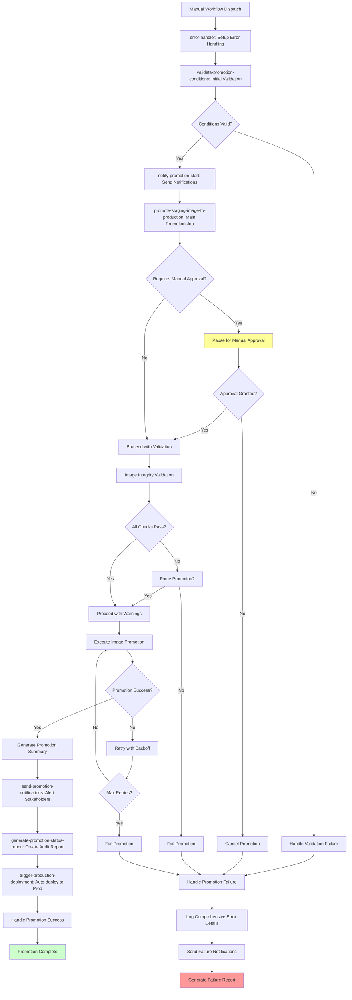
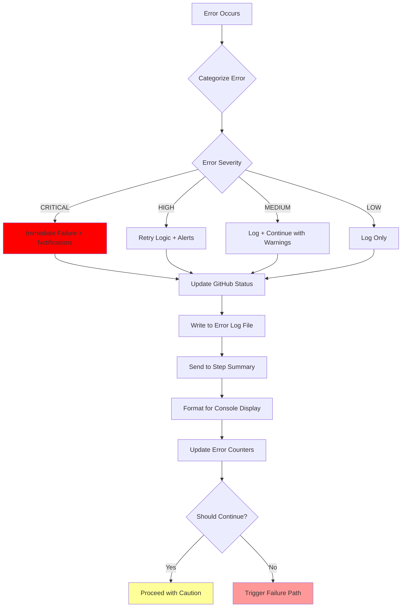
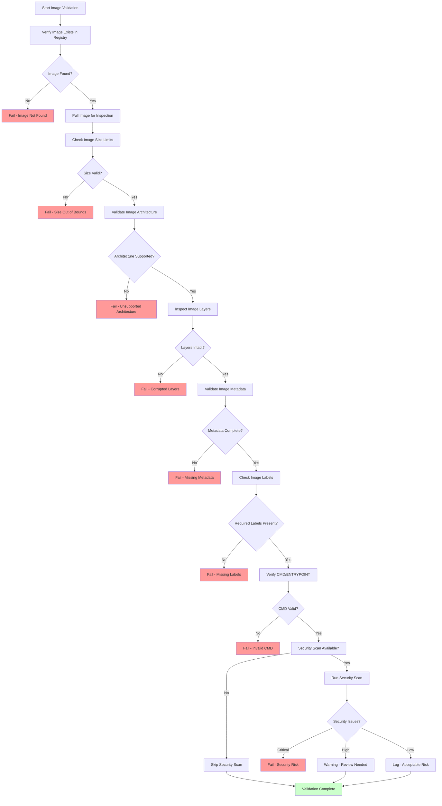
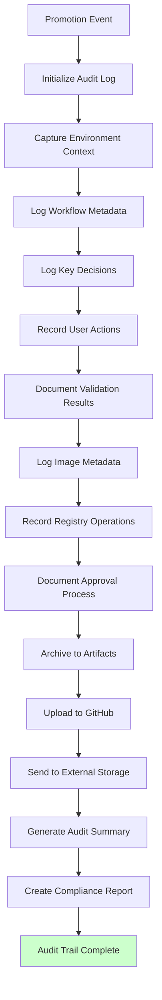
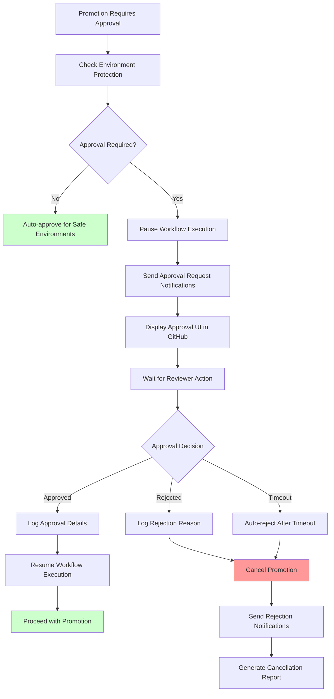
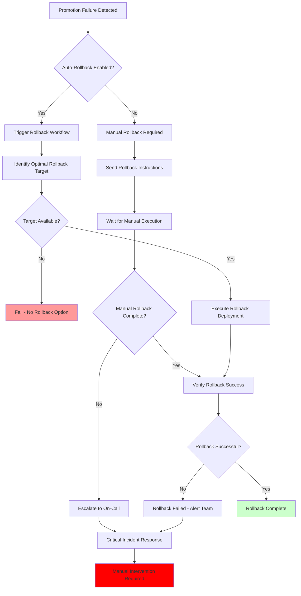

# Image Promotion Workflow

## Overview

This document details the comprehensive workflow for promoting tested staging images to production in the DotCA CI/CD pipeline. The workflow includes sophisticated error handling, extensive validation, manual approval gates, and complete audit logging to ensure secure and reliable production deployments.

## Main Promotion Workflow

The actual image promotion workflow is significantly more sophisticated than basic validation and copying. It includes comprehensive error handling, extensive logging, and multiple safety mechanisms.

## Detailed Sub-Workflows

### 1. Comprehensive Error Handling System

The workflow includes a sophisticated error handling system with categorized logging:

**Error Categories:**

- **VALIDATION**: Image integrity and metadata issues
- **NETWORK**: Registry connectivity problems
- **AUTHENTICATION**: GHCR access issues
- **REGISTRY**: Docker registry operations
- **DOCKER**: Container runtime issues
- **PERMISSION**: Access control problems
- **TIMEOUT**: Operation timeouts
- **UNKNOWN**: Unclassified errors

### 2. Image Validation Process

The actual validation process is much more comprehensive than basic checks:

### 3. Audit Logging and Compliance

The workflow maintains comprehensive audit trails for compliance and debugging:

**Audit Log Contents:**

- **Workflow Metadata**: Run ID, actor, repository, timestamps
- **Image Information**: Source/destination tags, SHA256 hashes, sizes
- **Validation Results**: All checks performed with pass/fail status
- **Approval Records**: Who approved, when, and under what conditions
- **Error Details**: Categorized errors with context and resolution attempts
- **Performance Metrics**: Timing data for each major operation

### 4. Manual Approval Process

The workflow includes sophisticated manual approval mechanisms:

**Approval Features:**

- **Environment Protection Rules**: Configurable required reviewers
- **Timeout Handling**: Automatic rejection after inactivity
- **Audit Trail**: Complete record of who approved/rejected and when
- **Notifications**: Alerts to stakeholders about pending approvals
- **Comments Support**: Reviewers can add approval comments

### 7. Rollback Process

The promotion workflow integrates with comprehensive rollback capabilities:

**Rollback Integration Features:**

- **Automatic Triggers**: Failed promotions can auto-trigger rollback workflows
- **Target Selection**: Intelligent selection of best rollback image
- **Health Verification**: Post-rollback health checks and validation
- **Notification Cascade**: Alerts for rollback events and outcomes

## Workflow States and Transitions

### Comprehensive Promotion States

The actual workflow has more granular states than basic promotion steps:

1. **Initializing** - Setting up error handling utilities and logging
2. **Validating Conditions** - Checking prerequisites and environment readiness
3. **Pending Approval** - Awaiting manual reviewer approval (if required)
4. **Approval Granted** - Manual approval received, proceeding with validation
5. **Validation Running** - Comprehensive image integrity and security checks
6. **Validation Passed** - All checks completed successfully
7. **Validation Failed** - Checks failed, force promotion may be available
8. **Promotion Running** - Actively copying image to production registry
9. **Promotion Retrying** - Retry logic for transient failures
10. **Promotion Failed** - All retries exhausted, promotion unsuccessful
11. **Promotion Succeeded** - Image successfully promoted to production
12. **Generating Reports** - Creating audit logs and status reports
13. **Notifications Sent** - Stakeholders notified of outcome
14. **Triggering Deployment** - Automatic production deployment initiated
15. **Completed Successfully** - Full promotion and deployment cycle complete
16. **Failed** - Promotion failed with comprehensive error reporting

### Key Decision Points

- **Manual Approval Required**: Environment protection rules and reviewer requirements
- **Force Promotion Available**: Override validation failures for emergency deployments
- **Retry Logic**: Configurable retry attempts with exponential backoff
- **Error Severity**: Critical errors trigger immediate failure, others may allow continuation
- **Rollback Triggers**: Automatic rollback on deployment failures
- **Notification Channels**: Multiple communication channels based on event severity

### Error Recovery Mechanisms

- **Categorized Error Handling**: Errors classified by severity (Critical, High, Medium, Low)
- **Automatic Retry Logic**: Configurable retry attempts with backoff strategies
- **Force Promotion Option**: Emergency override for validation failures
- **Rollback Integration**: Automatic triggers for failed promotions
- **Comprehensive Logging**: Detailed error logs with context and resolution attempts
- **Stakeholder Notifications**: Immediate alerts for failures and recovery actions

## Integration Points

### GitHub Actions Ecosystem

- **deploy.yml**: Unified workflow that builds environment-specific images
- **deployment-dashboard.yml**: Provides deployment status and notifications
- **deployment-metrics.yml**: Tracks deployment metrics and performance
- **rollback.yml**: Emergency rollback capability integration
- **deployment-notifications.yml**: Centralized notification system (reusable workflow)
- **workflow-coordinator.yml**: Validates workflow dependencies and sequencing

### Infrastructure Integration

- **Terraform**: Infrastructure provisioning for staging and production environments
- **Ansible**: Application deployment and configuration management
- **DigitalOcean**: Cloud infrastructure provider (droplets, networking, DNS)
- **GitHub Container Registry**: Private image storage and distribution

### Security and Compliance

- **GitHub Environments**: Protected environments with required reviewers
- **GitHub Secrets**: Encrypted storage for API keys, tokens, and credentials
- **SSH Key Management**: Secure server access with fingerprint validation
- **Audit Logging**: Comprehensive compliance trail for all operations

### Monitoring and Alerting

- **Real-time Notifications**: Slack, Teams, Email, and GitHub integrations
- **Health Monitoring**: Automated health checks and endpoint validation
- **Performance Tracking**: Deployment timing and resource usage metrics
- **Error Categorization**: Structured error reporting with severity levels
- **Status Dashboards**: Visual monitoring of deployment pipeline status

### External Service Integration

- **Brevo (Email)**: Transactional email notifications
- **Stripe**: Payment processing (if applicable)
- **Google Analytics**: Usage tracking and analytics
- **DigitalOcean Spaces**: Object storage for backups and assets
