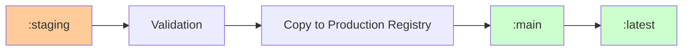

# Image Tagging Strategy for CI/CD Pipeline

## Overview

This document defines the image tagging strategy for the CI/CD pipeline, ensuring clear identification of images across staging and production environments, and enabling reliable image promotion and rollback capabilities.

## Registry Organization

### GitHub Container Registry (GHCR) Structure

```
ghcr.io/bxtech/dotca/
├── :staging          # Latest staging build
├── :staging-{sha}   # Specific staging commit
├── :main            # Latest production build (promoted)
├── :main-{sha}      # Specific production commit
├── :latest          # Latest stable release
├── :v{major}.{minor}.{patch}  # Semantic version tags
└── :rollback-{timestamp}      # Rollback targets
```

### Registry Access Control

| Environment | Read Access         | Write Access         | Purpose                 |
| ----------- | ------------------- | -------------------- | ----------------------- |
| Staging     | All users           | Staging pipeline     | Development and testing |
| Production  | Production pipeline | Image promotion only | Production deployments  |
| Versioned   | All users           | Release pipeline     | Stable releases         |

## Image Tagging Conventions

### 1. Environment-Based Tags

#### Staging Environment

- **Primary Tag**: `:staging`
- **Commit Tags**: `:staging-{short-sha}` (e.g., `:staging-a1b2c3d`)
- **Branch Tags**: `:staging-{branch-name}` (e.g., `:staging-feature-auth`)
- **Build Tags**: `:staging-build-{build-number}` (e.g., `:staging-build-123`)

#### Production Environment

- **Primary Tag**: `:main`
- **Commit Tags**: `:main-{short-sha}` (e.g., `:main-a1b2c3d`)
- **Release Tags**: `:v{major}.{minor}.{patch}` (e.g., `:v1.2.3`)
- **Rollback Tags**: `:rollback-{timestamp}` (e.g., `:rollback-20241201-143022`)

### 2. Semantic Versioning Tags

```
:v1.0.0     # Major release
:v1.1.0     # Minor release
:v1.1.1     # Patch release
:v1.2.0-beta.1  # Pre-release
:v1.2.0-rc.1    # Release candidate
```

### 3. Special Purpose Tags

- **`:latest`** - Always points to the most recent stable production release
- **`:stable`** - Points to the most recent production release that has been running for 24+ hours
- **`:canary`** - Points to a production image for A/B testing or gradual rollouts

## Image Promotion Strategy

### Promotion Flow



### Promotion Rules

1. **Automatic Promotion**: `:staging` → `:main` after successful testing
2. **Version Promotion**: `:main` → `:v{major}.{minor}.{patch}` after production validation
3. **Latest Update**: `:v{major}.{minor}.{patch}` → `:latest` after 24-hour stability period
4. **Rollback Protection**: Never automatically overwrite versioned tags

### Image Copying Process

```bash
# Example promotion commands
docker pull ghcr.io/bxtech/dotca:staging
docker tag ghcr.io/bxtech/dotca:staging ghcr.io/bxtech/dotca:main
docker push ghcr.io/bxtech/dotca:main

# For versioned releases
docker tag ghcr.io/bxtech/dotca:main ghcr.io/bxtech/dotca:v1.2.3
docker push ghcr.io/bxtech/dotca:v1.2.3
```

## Image Lifecycle Management

### Staging Images

| Tag Type             | Retention Policy         | Cleanup Schedule |
| -------------------- | ------------------------ | ---------------- |
| `:staging`           | Keep latest 5            | Daily            |
| `:staging-{sha}`     | Keep latest 20           | Weekly           |
| `:staging-{branch}`  | Keep latest 3 per branch | Weekly           |
| `:staging-build-{n}` | Keep latest 10           | Daily            |

### Production Images

| Tag Type                    | Retention Policy | Cleanup Schedule  |
| --------------------------- | ---------------- | ----------------- |
| `:main`                     | Keep latest 3    | Weekly            |
| `:main-{sha}`               | Keep latest 10   | Monthly           |
| `:v{major}.{minor}.{patch}` | Keep all         | Never (immutable) |
| `:rollback-{timestamp}`     | Keep latest 5    | Weekly            |
| `:latest`                   | Keep latest 2    | Weekly            |

### Cleanup Scripts

```bash
#!/bin/bash
# cleanup-old-images.sh

# Cleanup staging images older than 7 days
docker images ghcr.io/bxtech/dotca:staging-* --format "table {{.Repository}}:{{.Tag}}\t{{.CreatedAt}}" | \
  awk '$2 ~ /staging-/ {print $1}' | \
  xargs -I {} docker rmi {} 2>/dev/null || true

# Cleanup old production rollback images
docker images ghcr.io/bxtech/dotca:rollback-* --format "table {{.Repository}}:{{.Tag}}\t{{.CreatedAt}}" | \
  awk '$2 ~ /rollback-/ {print $1}' | \
  xargs -I {} docker rmi {} 2>/dev/null || true
```

## Tag Validation and Security

### Image Integrity Checks

1. **Size Validation**: Ensure image size is within expected range
2. **Layer Verification**: Verify all image layers are present and uncorrupted
3. **Signature Validation**: Verify image signatures if using signed images
4. **Vulnerability Scanning**: Run security scans before promotion

### Promotion Validation

```yaml
# Example validation rules
validation_rules:
  max_image_size_mb: 1024
  required_labels:
    - "org.opencontainers.image.source"
    - "org.opencontainers.image.version"
    - "org.opencontainers.image.created"
  security_scan:
    required: true
    max_critical_vulns: 0
    max_high_vulns: 2
```

## Rollback Strategy

### Rollback Tag Naming

```
:rollback-{YYYYMMDD}-{HHMMSS}-{reason}
Examples:
:rollback-20241201-143022-deployment-failure
:rollback-20241201-150045-health-check-failure
:rollback-20241201-160012-user-reported-issue
```

### Rollback Process

1. **Identify Rollback Target**: Find the last known good image
2. **Create Rollback Tag**: Tag the target image with rollback identifier
3. **Deploy Rollback Image**: Update production to use rollback image
4. **Verify Rollback**: Run health checks and validation
5. **Document Rollback**: Log reason, timestamp, and outcome

## Implementation in GitHub Actions

### Workflow Variables

```yaml
env:
  REGISTRY: ghcr.io
  IMAGE_NAME: ${{ github.repository }}
  STAGING_TAG: staging
  PRODUCTION_TAG: main
  VERSION_TAG: ${{ github.ref_name == 'main' && 'v1.0.0' || '' }}
```

### Tag Generation

```yaml
- name: Generate Image Tags
  id: tags
  run: |
    echo "staging=ghcr.io/${{ env.IMAGE_NAME }}:${{ env.STAGING_TAG }}" >> $GITHUB_OUTPUT
    echo "production=ghcr.io/${{ env.IMAGE_NAME }}:${{ env.PRODUCTION_TAG }}" >> $GITHUB_OUTPUT

    if [ "${{ github.ref_name }}" = "main" ]; then
      echo "version=ghcr.io/${{ env.IMAGE_NAME }}:${{ env.VERSION_TAG }}" >> $GITHUB_OUTPUT
    fi
```

### Image Promotion Commands

```yaml
- name: Promote Staging Image to Production
  run: |
    # Pull staging image
    docker pull ${{ steps.tags.outputs.staging }}

    # Tag for production
    docker tag ${{ steps.tags.outputs.staging }} ${{ steps.tags.outputs.production }}

    # Push to production registry
    docker push ${{ steps.tags.outputs.production }}

    # Update latest tag if this is a stable release
    if [ -n "${{ steps.tags.outputs.version }}" ]; then
      docker tag ${{ steps.tags.outputs.production }} ghcr.io/${{ env.IMAGE_NAME }}:latest
      docker push ghcr.io/${{ env.IMAGE_NAME }}:latest
    fi
```

## Monitoring and Alerting

### Tag Tracking

- **Real-time Updates**: Monitor tag creation and updates
- **Promotion Events**: Track successful and failed promotions
- **Rollback Alerts**: Immediate notification of rollback events
- **Cleanup Monitoring**: Track cleanup operations and storage usage

### Metrics to Track

- **Promotion Success Rate**: Percentage of successful promotions
- **Image Build Time**: Time from code push to production deployment
- **Rollback Frequency**: Number of rollbacks per time period
- **Storage Usage**: Registry storage consumption over time
- **Image Age**: Distribution of image ages in each environment

## Best Practices

### Do's

- ✅ Use semantic versioning for production releases
- ✅ Implement immutable tags for versioned releases
- ✅ Maintain clear separation between staging and production tags
- ✅ Document all rollback events with reasons
- ✅ Regular cleanup of old images to manage storage

### Don'ts

- ❌ Never overwrite versioned tags
- ❌ Don't use `:latest` for critical production deployments
- ❌ Avoid complex tag naming that's hard to parse
- ❌ Don't skip validation steps during promotion
- ❌ Never promote images that haven't passed all tests
