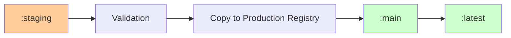

# Image Tagging Strategy for CI/CD Pipeline

## Overview

This document defines the image tagging strategy for the CI/CD pipeline, ensuring clear identification of images across staging and production environments, and enabling reliable image promotion and rollback capabilities.

## Build identity (what `deploy.yml` pushes)

A deploy tag names one build. The commit SHA is not enough: rebuilding that commit with a different secret or build arg produces a different image. `scripts/build-image-tag.cjs` names the image

```text
<branch>-<full commit sha>-<run id>-<run attempt>
```

for example `staging-03f064a1b2c3d4e5f678901234567890abcdef01-18473920123-1`. The workflow run id changes on every run, including `workflow_dispatch`. The run attempt changes when failed jobs are re-run. Both environments use this tag. `staging` / `main` (and `latest` on the default branch) remain moving pointers to the newest push; they are not rollback targets.

The Actions summary of the deploy run records that tag and the image digest. On the host, the running container's image name is that tag, and `docker image inspect --format '{{.RepoDigests}}' ghcr.io/bxmty/dotca:<tag>` is the digest. Those two together are one artifact.

### Rollback

Re-running the workflow builds a new image under a new run id. That is a new deploy, not a return to an earlier one.

To roll back, deploy the earlier build's tag. The playbooks read the Ansible variable `DEPLOY_DOCKER_IMAGE` (the same one CI writes into the inventory). Pass it as an extra var; a shell variable of that name is not visible to the play:

```bash
ansible-playbook -i inventory/deploy.ini staging-deploy.yml \
  -e DEPLOY_DOCKER_IMAGE=ghcr.io/bxmty/dotca:staging-03f064a1b2c3d4e5f678901234567890abcdef01-18473920123-1
```

Production uses the same extra var with `production-deploy.yml` and a `main-…` tag. Take the tag from the summary of the run you are returning to. The playbook's `docker pull` re-resolves that tag against the registry, including when the host already has it. If that tag is missing from the registry, the play fails. It does not substitute the moving `:staging` or `:main` tag.

## Registry Organization

### GitHub Container Registry (GHCR) Structure

```
ghcr.io/bxmty/dotca/
├── :staging          # Latest staging build (moving pointer)
├── :staging-{sha}-{run id}-{run attempt}   # One staging build
├── :main            # Latest production build (moving pointer)
├── :main-{sha}-{run id}-{run attempt}      # One production build
├── :latest          # Latest stable release
└── :v{major}.{minor}.{patch}  # Semantic version tags
```

### Registry Access Control

| Environment | Read Access         | Write Access         | Purpose                 |
| ----------- | ------------------- | -------------------- | ----------------------- |
| Staging     | All users           | Staging pipeline     | Development and testing |
| Production  | Production pipeline | Image promotion only | Production deployments  |
| Versioned   | All users           | Release pipeline     | Stable releases         |

## Image Tagging Conventions

### 1. Environment-Based Tags

#### Staging Environment

- **Primary Tag**: `:staging` (moving pointer, not a rollback target)
- **Build identity tag**: `:staging-{full-sha}-{run id}-{run attempt}` (one build; this is what deploy pushes)
- **Branch Tags**: `:staging-{branch-name}` (e.g., `:staging-feature-auth`)
- **Numbered build tags**: `:staging-build-{build-number}` (e.g., `:staging-build-123`)

#### Production Environment

- **Primary Tag**: `:main` (moving pointer, not a rollback target)
- **Build identity tag**: `:main-{full-sha}-{run id}-{run attempt}` (one build; this is what deploy pushes)
- **Release Tags**: `:v{major}.{minor}.{patch}` (e.g., `:v1.2.3`)

### 2. Semantic Versioning Tags

```
:v1.0.0     # Major release
:v1.1.0     # Minor release
:v1.1.1     # Patch release
:v1.2.0-beta.1  # Pre-release
:v1.2.0-rc.1    # Release candidate
```

### 3. Special Purpose Tags

- **`:latest`** - Always points to the most recent stable production release
- **`:stable`** - Points to the most recent production release that has been running for 24+ hours
- **`:canary`** - Points to a production image for A/B testing or gradual rollouts

## Image Promotion Strategy

### Promotion Flow


```mermaid
graph LR
    A[:staging] --> B[Validation]
    B --> C[Copy to Production Registry]
    C --> D[:main]
    D --> E[:latest]

    style A fill:#ffcc99
    style D fill:#ccffcc
    style E fill:#ccffcc
```

### Promotion Rules

1. **Automatic Promotion**: `:staging` → `:main` after successful testing
2. **Version Promotion**: `:main` → `:v{major}.{minor}.{patch}` after production validation
3. **Latest Update**: `:v{major}.{minor}.{patch}` → `:latest` after 24-hour stability period
4. **Rollback Protection**: Never automatically overwrite versioned tags

### Image Copying Process

```bash
# Example promotion commands
docker pull ghcr.io/bxtech/dotca:staging
docker tag ghcr.io/bxtech/dotca:staging ghcr.io/bxtech/dotca:main
docker push ghcr.io/bxtech/dotca:main

# For versioned releases
docker tag ghcr.io/bxtech/dotca:main ghcr.io/bxtech/dotca:v1.2.3
docker push ghcr.io/bxtech/dotca:v1.2.3
```

## Image Lifecycle Management

### Staging Images

| Tag Type                         | Retention Policy         | Cleanup Schedule |
| -------------------------------- | ------------------------ | ---------------- |
| `:staging`                       | Keep latest 5            | Daily            |
| `:staging-{sha}-{run}-{attempt}` | Keep latest 20           | Weekly           |
| `:staging-{branch}`              | Keep latest 3 per branch | Weekly           |
| `:staging-build-{n}`             | Keep latest 10           | Daily            |

### Production Images

| Tag Type                      | Retention Policy | Cleanup Schedule  |
| ----------------------------- | ---------------- | ----------------- |
| `:main`                       | Keep latest 3    | Weekly            |
| `:main-{sha}-{run}-{attempt}` | Keep latest 10   | Monthly           |
| `:v{major}.{minor}.{patch}`   | Keep all         | Never (immutable) |
| `:latest`                     | Keep latest 2    | Weekly            |

### Cleanup Scripts

```bash
#!/bin/bash
# cleanup-old-images.sh

# Cleanup staging images older than 7 days
docker images ghcr.io/bxtech/dotca:staging-* --format "table {{.Repository}}:{{.Tag}}\t{{.CreatedAt}}" | \
  awk '$2 ~ /staging-/ {print $1}' | \
  xargs -I {} docker rmi {} 2>/dev/null || true

# Cleanup old production rollback images
docker images ghcr.io/bxtech/dotca:rollback-* --format "table {{.Repository}}:{{.Tag}}\t{{.CreatedAt}}" | \
  awk '$2 ~ /rollback-/ {print $1}' | \
  xargs -I {} docker rmi {} 2>/dev/null || true
```

## Tag Validation and Security

### Image Integrity Checks

1. **Size Validation**: Ensure image size is within expected range
2. **Layer Verification**: Verify all image layers are present and uncorrupted
3. **Signature Validation**: Verify image signatures if using signed images
4. **Vulnerability Scanning**: Run security scans before promotion

### Promotion Validation

```yaml
# Example validation rules
validation_rules:
  max_image_size_mb: 1024
  required_labels:
    - "org.opencontainers.image.source"
    - "org.opencontainers.image.version"
    - "org.opencontainers.image.created"
  security_scan:
    required: true
    max_critical_vulns: 0
    max_high_vulns: 2
```

## Rollback Strategy

Roll back by redeploying an earlier build-identity tag, as described under [Build identity](#build-identity-what-deployyml-pushes). Do not mint a separate `:rollback-*` tag: the original tag already names that build, and a second name would be another thing to keep in sync.

1. **Identify the target**: Copy the image tag and digest from the Actions summary of the last good run.
2. **Deploy that tag**: Pass `DEPLOY_DOCKER_IMAGE` with `ansible-playbook -e` and run the environment's playbook.
3. **Verify**: The running container's image is that tag, and its repo digest matches the summary.

## Implementation in GitHub Actions

### Workflow Variables

```yaml
env:
  REGISTRY: ghcr.io
  IMAGE_NAME: ${{ github.repository }}
  STAGING_TAG: staging
  PRODUCTION_TAG: main
  VERSION_TAG: ${{ github.ref_name == 'main' && 'v1.0.0' || '' }}
```

### Tag Generation

```yaml
- name: Generate Image Tags
  id: tags
  run: |
    echo "staging=ghcr.io/${{ env.IMAGE_NAME }}:${{ env.STAGING_TAG }}" >> $GITHUB_OUTPUT
    echo "production=ghcr.io/${{ env.IMAGE_NAME }}:${{ env.PRODUCTION_TAG }}" >> $GITHUB_OUTPUT

    if [ "${{ github.ref_name }}" = "main" ]; then
      echo "version=ghcr.io/${{ env.IMAGE_NAME }}:${{ env.VERSION_TAG }}" >> $GITHUB_OUTPUT
    fi
```

### Image Promotion Commands

```yaml
- name: Promote Staging Image to Production
  run: |
    # Pull staging image
    docker pull ${{ steps.tags.outputs.staging }}

    # Tag for production
    docker tag ${{ steps.tags.outputs.staging }} ${{ steps.tags.outputs.production }}

    # Push to production registry
    docker push ${{ steps.tags.outputs.production }}

    # Update latest tag if this is a stable release
    if [ -n "${{ steps.tags.outputs.version }}" ]; then
      docker tag ${{ steps.tags.outputs.production }} ghcr.io/${{ env.IMAGE_NAME }}:latest
      docker push ghcr.io/${{ env.IMAGE_NAME }}:latest
    fi
```

## Monitoring and Alerting

### Tag Tracking

- **Real-time Updates**: Monitor tag creation and updates
- **Promotion Events**: Track successful and failed promotions
- **Rollback Alerts**: Immediate notification of rollback events
- **Cleanup Monitoring**: Track cleanup operations and storage usage

### Metrics to Track

- **Promotion Success Rate**: Percentage of successful promotions
- **Image Build Time**: Time from code push to production deployment
- **Rollback Frequency**: Number of rollbacks per time period
- **Storage Usage**: Registry storage consumption over time
- **Image Age**: Distribution of image ages in each environment

## Best Practices

### Do's

- ✅ Use semantic versioning for production releases
- ✅ Implement immutable tags for versioned releases
- ✅ Maintain clear separation between staging and production tags
- ✅ Document all rollback events with reasons
- ✅ Regular cleanup of old images to manage storage

### Don'ts

- ❌ Never overwrite versioned tags
- ❌ Don't use `:latest` for critical production deployments
- ❌ Avoid complex tag naming that's hard to parse
- ❌ Don't skip validation steps during promotion
- ❌ Never promote images that haven't passed all tests
