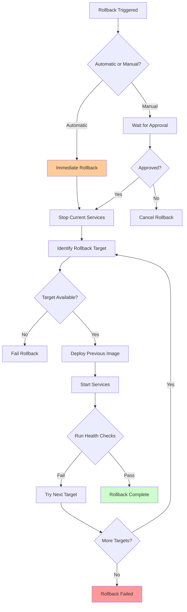

# Rollback Strategy and Image Retention Policy

## Overview

This document defines the rollback strategy and image retention policy for the CI/CD pipeline, ensuring quick recovery from failed deployments while maintaining efficient storage management.

## Rollback Strategy

### Rollback Triggers

#### Automatic Rollback
The system will automatically trigger rollbacks when:

1. **Health Check Failures**
   - Application health checks fail for 3 consecutive attempts
   - Database connectivity issues persist for 2+ minutes
   - Critical endpoints return 5xx errors for 5+ consecutive requests

2. **Deployment Failures**
   - Container fails to start within 5 minutes
   - Service crashes within 2 minutes of deployment
   - Resource limits exceeded (CPU/Memory)

3. **Performance Degradation**
   - Response time increases by 300% from baseline
   - Error rate exceeds 5% for 3+ minutes
   - Memory usage exceeds 90% for 5+ minutes

#### Manual Rollback
Manual rollbacks can be triggered by:

1. **User Reports**: Critical user-reported issues
2. **Business Requirements**: Feature rollback requests
3. **Security Concerns**: Vulnerability discoveries
4. **Performance Issues**: Sustained performance degradation

### Rollback Decision Matrix

| Issue Type | Severity | Auto-Rollback | Manual Approval | Rollback Speed |
|------------|----------|---------------|-----------------|----------------|
| Service Crash | Critical | ✅ Yes | ❌ No | < 2 minutes |
| Health Check Fail | High | ✅ Yes | ❌ No | < 3 minutes |
| Performance Degradation | Medium | ❌ No | ✅ Yes | < 5 minutes |
| User Reports | Medium | ❌ No | ✅ Yes | < 10 minutes |
| Feature Issues | Low | ❌ No | ✅ Yes | < 15 minutes |

### Rollback Process



### Rollback Target Selection

#### Priority Order for Rollback Targets

1. **Previous Production Image** (`:main-{previous-sha}`)
   - Most recent known good production deployment
   - Highest confidence level
   - Fastest rollback option

2. **Last Stable Release** (`:v{major}.{minor}.{patch}`)
   - Last semantic version release
   - Proven stability over time
   - Medium confidence level

3. **Rollback-Specific Image** (`:rollback-{timestamp}-{reason}`)
   - Previously created rollback images
   - Documented rollback reasons
   - Lower confidence level

4. **Emergency Fallback** (`:emergency-{date}`)
   - Last resort emergency images
   - Basic functionality guaranteed
   - Lowest confidence level

#### Rollback Target Validation

```yaml
# Rollback validation rules
rollback_validation:
  health_check_timeout: 300  # 5 minutes
  max_rollback_attempts: 3
  required_checks:
    - service_startup
    - health_endpoints
    - database_connectivity
    - basic_functionality
  
  target_selection:
    max_age_hours: 168  # 1 week
    min_uptime_hours: 2
    required_tests_passed: true
```

## Image Retention Policy

### Retention Categories

#### 1. Production Images (Keep Longer)

| Tag Pattern | Retention Period | Cleanup Schedule | Reason |
|-------------|------------------|------------------|---------|
| `:v{major}.{minor}.{patch}` | **Indefinite** | Never | Immutable releases |
| `:main` | 30 days | Weekly | Current production |
| `:main-{sha}` | 90 days | Monthly | Production history |
| `:latest` | 60 days | Weekly | Latest stable |
| `:rollback-{timestamp}` | 30 days | Weekly | Rollback targets |

#### 2. Staging Images (Shorter Retention)

| Tag Pattern | Retention Period | Cleanup Schedule | Reason |
|-------------|------------------|------------------|---------|
| `:staging` | 7 days | Daily | Current staging |
| `:staging-{sha}` | 14 days | Weekly | Staging history |
| `:staging-{branch}` | 7 days | Weekly | Feature branches |
| `:staging-build-{n}` | 3 days | Daily | Build artifacts |

#### 3. Development Images (Shortest Retention)

| Tag Pattern | Retention Period | Cleanup Schedule | Reason |
|-------------|------------------|------------------|---------|
| `:dev-{branch}` | 3 days | Daily | Development work |
| `:test-{feature}` | 1 day | Daily | Feature testing |
| `:experimental` | 1 day | Daily | Experimental builds |

### Storage Management

#### Storage Limits

```yaml
storage_limits:
  total_registry_size_gb: 100
  staging_images_gb: 20
  production_images_gb: 60
  development_images_gb: 20
  
  cleanup_thresholds:
    warning_at_percent: 80
    critical_at_percent: 90
    emergency_at_percent: 95
```

#### Cleanup Strategies

##### 1. Time-Based Cleanup
```bash
#!/bin/bash
# cleanup-by-age.sh

# Cleanup staging images older than 7 days
find_staging_images_older_than 7d | cleanup_images

# Cleanup production images older than 30 days (except versioned)
find_production_images_older_than 30d | exclude_versioned | cleanup_images

# Cleanup rollback images older than 30 days
find_rollback_images_older_than 30d | cleanup_images
```

##### 2. Size-Based Cleanup
```bash
#!/bin/bash
# cleanup-by-size.sh

# When storage exceeds 80%, remove oldest non-versioned images
if [ $(get_storage_usage_percent) -gt 80 ]; then
  find_oldest_non_versioned_images | cleanup_images
fi

# When storage exceeds 90%, remove all non-versioned images
if [ $(get_storage_usage_percent) -gt 90 ]; then
  find_all_non_versioned_images | cleanup_images
fi
```

##### 3. Priority-Based Cleanup
```bash
#!/bin/bash
# cleanup-by-priority.sh

# Priority order for cleanup (lowest priority first)
cleanup_order=(
  "staging-build-*"      # Build artifacts
  "staging-{branch}"     # Feature branches
  "dev-*"                # Development images
  "test-*"               # Test images
  "rollback-*"           # Old rollback images
  "main-{sha}"           # Old production commits
  "staging-{sha}"        # Old staging commits
)

for pattern in "${cleanup_order[@]}"; do
  cleanup_images_by_pattern "$pattern"
  if [ $(get_storage_usage_percent) -lt 70 ]; then
    break  # Stop if we're under threshold
  fi
done
```

### Retention Policy Enforcement

#### Automated Cleanup Workflow

```yaml
# GitHub Actions cleanup workflow
name: Image Cleanup
on:
  schedule:
    - cron: '0 2 * * *'  # Daily at 2 AM
  workflow_dispatch:     # Manual trigger

jobs:
  cleanup:
    runs-on: ubuntu-latest
    steps:
      - name: Check Storage Usage
        id: storage
        run: |
          USAGE=$(gh api repos/${{ github.repository }}/packages/container/dotca --jq '.metadata.container.metadata.tags | length')
          echo "usage=$USAGE" >> $GITHUB_OUTPUT
      
      - name: Cleanup Old Images
        if: steps.storage.outputs.usage > 50
        run: |
          # Run cleanup scripts
          ./scripts/cleanup-by-age.sh
          ./scripts/cleanup-by-size.sh
      
      - name: Report Cleanup Results
        run: |
          echo "Cleanup completed at $(date)"
          echo "Current storage usage: $(gh api repos/${{ github.repository }}/packages/container/dotca --jq '.metadata.container.metadata.tags | length') images"
```

#### Manual Cleanup Commands

```bash
# Manual cleanup commands for administrators

# List all images with creation dates
docker images ghcr.io/bxtech/dotca --format "table {{.Repository}}:{{.Tag}}\t{{.CreatedAt}}\t{{.Size}}"

# Remove specific image
docker rmi ghcr.io/bxtech/dotca:staging-old

# Remove all staging images except current
docker images ghcr.io/bxtech/dotca:staging-* --format "{{.Repository}}:{{.Tag}}" | \
  grep -v ":staging$" | \
  xargs -I {} docker rmi {}

# Force remove dangling images
docker image prune -f
```

## Rollback Implementation

### Rollback Workflow in GitHub Actions

```yaml
# Rollback workflow
name: Production Rollback
on:
  workflow_dispatch:
    inputs:
      rollback_target:
        description: 'Rollback target (image tag)'
        required: true
        default: 'main-previous'
      rollback_reason:
        description: 'Reason for rollback'
        required: true
        default: 'Manual rollback request'

jobs:
  rollback:
    runs-on: ubuntu-latest
    steps:
      - name: Validate Rollback Target
        run: |
          # Check if target image exists
          if ! docker pull ghcr.io/bxtech/dotca:${{ github.event.inputs.rollback_target }}; then
            echo "::error::Rollback target not found"
            exit 1
          fi
      
      - name: Create Rollback Tag
        run: |
          TIMESTAMP=$(date +%Y%m%d-%H%M%S)
          REASON="${{ github.event.inputs.rollback_reason }}"
          
          docker tag ghcr.io/bxtech/dotca:${{ github.event.inputs.rollback_target }} \
            ghcr.io/bxtech/dotca:rollback-$TIMESTAMP-$REASON
          
          docker push ghcr.io/bxtech/dotca:rollback-$TIMESTAMP-$REASON
      
      - name: Deploy Rollback Image
        run: |
          # Update production to use rollback image
          ./scripts/deploy-production.sh rollback-$TIMESTAMP-$REASON
      
      - name: Verify Rollback
        run: |
          # Wait for services to start
          sleep 60
          
          # Run health checks
          ./scripts/health-check.sh
          
          # Verify endpoints
          ./scripts/endpoint-verification.sh
```

### Rollback Monitoring

#### Rollback Metrics

```yaml
metrics_to_track:
  rollback_frequency:
    - daily_rollbacks
    - weekly_rollbacks
    - monthly_rollbacks
  
  rollback_success_rate:
    - successful_rollbacks
    - failed_rollbacks
    - partial_rollbacks
  
  rollback_performance:
    - time_to_rollback
    - time_to_healthy
    - total_downtime
```

#### Rollback Alerts

```yaml
alerts:
  rollback_triggered:
    - channel: "#devops-alerts"
    - message: "🚨 Production rollback triggered: ${{ github.event.inputs.rollback_reason }}"
  
  rollback_complete:
    - channel: "#devops-alerts"
    - message: "✅ Production rollback completed successfully"
  
  rollback_failed:
    - channel: "#devops-alerts"
    - message: "❌ Production rollback failed - manual intervention required"
```

## DevOps Engineer Instructions

### Emergency Rollback Procedures

#### 1. Immediate Rollback (Critical Issues)

When facing critical production issues that require immediate rollback:

```bash
# Step 1: Assess the situation (SSH to production server)
ssh root@your-production-server

# Check current container status
docker ps | grep dotca
docker logs dotca-app-web-1 --tail=50

# Step 2: Identify current production image
CURRENT_IMAGE=$(docker inspect dotca-app-web-1 --format='{{.Config.Image}}')
echo "Current image: $CURRENT_IMAGE"

# Step 3: Find the previous stable image
# Check image history in GitHub Container Registry
gh api repos/bxtech/dotca/packages/container/dotca/versions | jq -r '.[].metadata.container.tags[]' | head -10

# Step 4: Execute rollback via GitHub Actions
gh workflow run rollback.yml \
  --field rollback_target="main-{previous-sha}" \
  --field rollback_reason="Critical production issue - immediate rollback required"
```

#### 2. Planned Rollback (Non-Critical Issues)

For planned rollbacks with lower urgency:

```bash
# Step 1: Analyze the issue (SSH to production server)
ssh root@your-production-server

# Review logs, metrics, and user reports
docker logs dotca-app-web-1 --since=1h | grep ERROR
docker stats dotca-app-web-1 --no-stream

# Step 2: Identify appropriate rollback target
# Check recent deployments in Docker Compose
cd /app/repo
docker images ghcr.io/bxtech/dotca | head -5

# Step 3: Create rollback branch (for tracking)
git checkout -b rollback/$(date +%Y%m%d-%H%M%S)
git commit --allow-empty -m "Rollback initiated: [REASON]"
git push origin rollback/$(date +%Y%m%d-%H%M%S)

# Step 4: Execute controlled rollback
gh workflow run rollback.yml \
  --field rollback_target="v1.2.3" \
  --field rollback_reason="Performance degradation in new feature"
```

#### 3. Manual Rollback (Workflow Failure)

If GitHub Actions rollback workflow fails:

```bash
# Step 1: SSH to production server
ssh root@your-production-server
cd /app/repo

# Step 2: Update docker-compose.yml with rollback image
# Edit the environment variable to use rollback image
export DOCKER_IMAGE=ghcr.io/bxtech/dotca:main-{previous-sha}

# Step 3: Pull the rollback image
docker pull $DOCKER_IMAGE

# Step 4: Stop current services and deploy rollback
docker-compose down
docker-compose up -d

# Step 5: Verify rollback deployment
docker-compose ps
docker logs dotca-app-web-1 --tail=20
```

### Rollback Verification Checklist

After any rollback, verify the following:

```bash
# ✓ 1. Container Status (SSH to production server)
ssh root@your-production-server
docker ps | grep dotca

# ✓ 2. Service Health
curl -f http://your-production-server/api/health || echo "Health check failed"

# ✓ 3. Application Logs
docker logs dotca-app-web-1 --tail=20 | grep -E "(ERROR|FATAL|started|ready)"

# ✓ 4. Container Resource Usage
docker stats dotca-app-web-1 --no-stream

# ✓ 5. External Integrations
curl -f http://your-production-server/api/status || echo "API status check failed"

# ✓ 6. Nginx Status (if using reverse proxy)
systemctl status nginx
nginx -t

# ✓ 7. SSL Certificate Status (if configured)
curl -I https://your-domain.com | grep -E "(200|301|302)"

# ✓ 8. Docker Compose Services
cd /app/repo && docker-compose ps
```

### Troubleshooting Common Rollback Issues

#### Issue 1: Rollback Target Not Found

```bash
# Problem: Image tag doesn't exist in registry
# Solution: Find available tags
gh api repos/bxtech/dotca/packages/container/dotca/versions | \
  jq -r '.[].metadata.container.tags[]' | \
  grep -E "(main-|v[0-9])" | \
  head -20

# Use the most recent available tag
gh workflow run rollback.yml --field rollback_target="main-{available-sha}"
```

#### Issue 2: Rollback Deployment Fails

```bash
# Problem: Docker container fails to start
# Solution: Check resource constraints and conflicts

# Check system resource usage
ssh root@your-production-server
free -h
df -h
docker system df

# Check for port conflicts
netstat -tlnp | grep :8080

# Force cleanup if needed
docker-compose down --remove-orphans
docker system prune -f
docker volume prune -f
```

#### Issue 3: Database Migration Conflicts

```bash
# Problem: Database schema incompatibility
# Solution: Check and potentially rollback migrations

# SSH to production server and check migration status
ssh root@your-production-server
cd /app/repo

# Check current migration status (if using a database)
docker-compose exec web npm run db:migrate:status

# If needed, rollback migrations to previous state
docker-compose exec web npm run db:migrate:down

# Verify database state
docker-compose exec web npm run db:check

# Alternative: Access container directly
docker exec -it dotca-app-web-1 npm run db:migrate:status
```

### Monitoring and Alerting for DevOps

#### Real-time Monitoring Commands

```bash
# Monitor rollback progress (SSH to production server)
ssh root@your-production-server
watch docker ps

# Monitor application health
watch curl -s http://your-production-server/api/health | jq '.status'

# Monitor error rates
docker logs dotca-app-web-1 -f | grep ERROR

# Monitor resource usage during rollback
watch docker stats dotca-app-web-1

# Monitor Docker Compose services
cd /app/repo && watch docker-compose ps
```

#### Alert Configuration

Set up monitoring alerts for:

```yaml
# Slack/Teams notification commands
rollback_alerts:
  start_rollback: |
    curl -X POST -H 'Content-type: application/json' \
    --data '{"text":"🚨 ROLLBACK STARTED: Production rollback initiated by $USER"}' \
    $SLACK_WEBHOOK_URL
  
  rollback_success: |
    curl -X POST -H 'Content-type: application/json' \
    --data '{"text":"✅ ROLLBACK COMPLETE: Production successfully rolled back"}' \
    $SLACK_WEBHOOK_URL
  
  rollback_failed: |
    curl -X POST -H 'Content-type: application/json' \
    --data '{"text":"❌ ROLLBACK FAILED: Manual intervention required in production"}' \
    $SLACK_WEBHOOK_URL
```

### Post-Rollback Actions

#### 1. Immediate Actions (Within 10 minutes)

```bash
# Document the incident
echo "Rollback completed at $(date)" >> /tmp/rollback-log.txt
echo "Reason: $ROLLBACK_REASON" >> /tmp/rollback-log.txt
echo "Target: $ROLLBACK_TARGET" >> /tmp/rollback-log.txt

# Notify stakeholders
./scripts/notify-rollback-complete.sh
```

#### 2. Short-term Actions (Within 1 hour)

```bash
# Create incident report
gh issue create \
  --title "Production Rollback: $(date +%Y-%m-%d)" \
  --body "Rollback completed. Details: [REASON]. Target: [TARGET]. Impact: [DESCRIPTION]"

# Update monitoring dashboards
# Check Grafana/monitoring tools for impact metrics

# Review logs for root cause
kubectl logs -n production deployment/dotca-app --since=2h > rollback-analysis.log
```

#### 3. Long-term Actions (Within 24 hours)

```bash
# Conduct rollback retrospective
# Schedule meeting with team to discuss:
# - What caused the need for rollback
# - How to prevent similar issues
# - Improvements to rollback process

# Update documentation if needed
# Document any new procedures discovered
# Update runbooks with lessons learned
```

### DevOps Escalation Procedures

#### Level 1: DevOps Engineer
- Execute standard rollback procedures
- Verify application health
- Monitor for 30 minutes post-rollback

#### Level 2: Senior DevOps/Platform Team
- Complex rollback scenarios
- Database migration conflicts
- Infrastructure-level issues

#### Level 3: Engineering Leadership
- Business-critical failures
- Security incidents requiring rollback
- Multi-service rollback coordination

### Emergency Contacts

```yaml
emergency_contacts:
  primary_oncall: "+1-XXX-XXX-XXXX"
  secondary_oncall: "+1-XXX-XXX-XXXX"
  platform_team_lead: "+1-XXX-XXX-XXXX"
  engineering_manager: "+1-XXX-XXX-XXXX"

communication_channels:
  primary: "#devops-alerts"
  secondary: "#engineering-incidents"
  executive: "#exec-incidents"
```

## Best Practices

### Rollback Best Practices

1. **Always have rollback targets available**
   - Maintain at least 3 previous production images
   - Keep versioned releases indefinitely
   - Document rollback reasons and outcomes

2. **Test rollback procedures regularly**
   - Monthly rollback drills
   - Verify rollback targets are accessible
   - Test rollback speed and success rate

3. **Monitor rollback effectiveness**
   - Track rollback success rates
   - Measure time to recovery
   - Document lessons learned

### Retention Best Practices

1. **Balance storage costs with recovery needs**
   - Keep critical images longer
   - Clean up development artifacts quickly
   - Use automated cleanup to prevent manual errors

2. **Document retention decisions**
   - Explain why certain images are kept longer
   - Document cleanup schedules and policies
   - Maintain audit trail of cleanup operations

3. **Regular policy review**
   - Review retention periods quarterly
   - Adjust based on business needs
   - Optimize for cost and recovery requirements
