# Component Interaction Diagram for Unified Deployment System

## Overview

This document provides a comprehensive view of how all components in the unified deployment system interact with each other, showing data flow, triggers, and dependencies between different parts of the system.

## System Architecture Overview

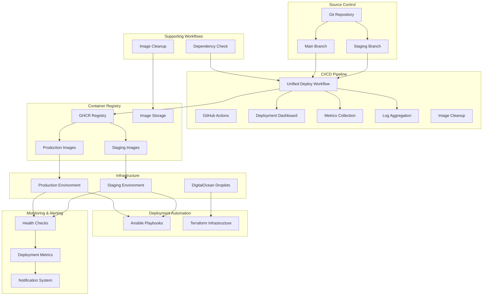

## Detailed Component Interactions

### 1. Unified Deployment Flow

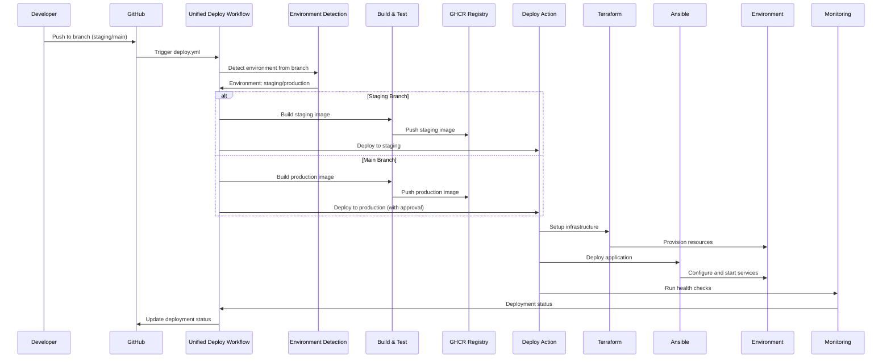

### 2. Environment Detection Flow

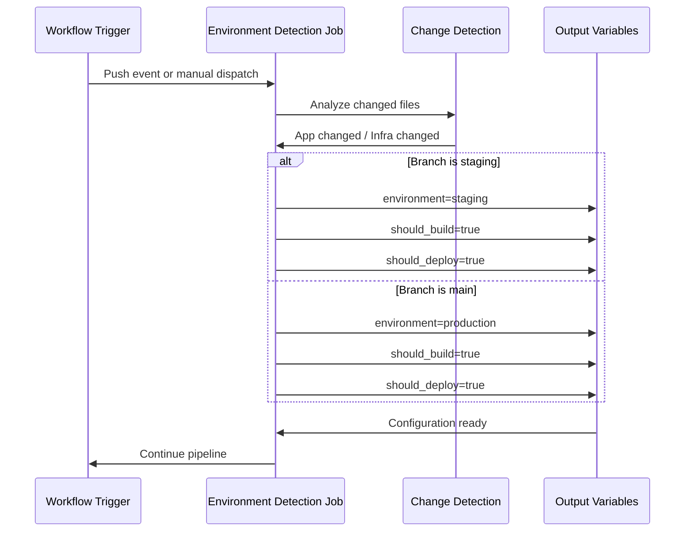

### 3. Build and Quality Assurance Flow

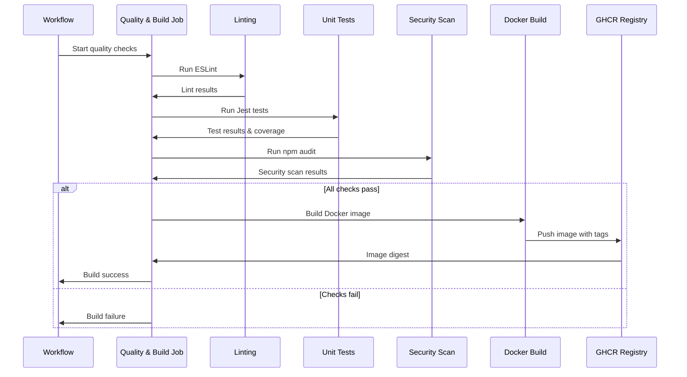

### 4. Deployment Flow

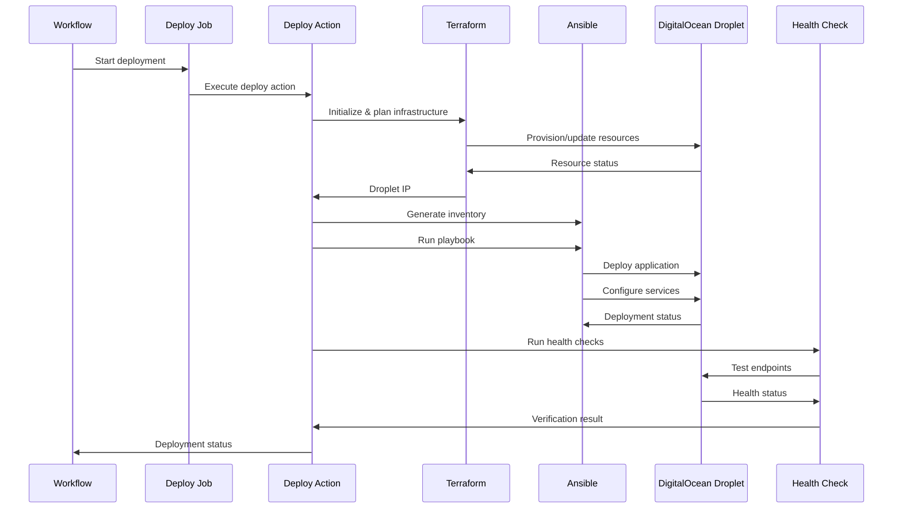

### 5. Testing Integration Flow

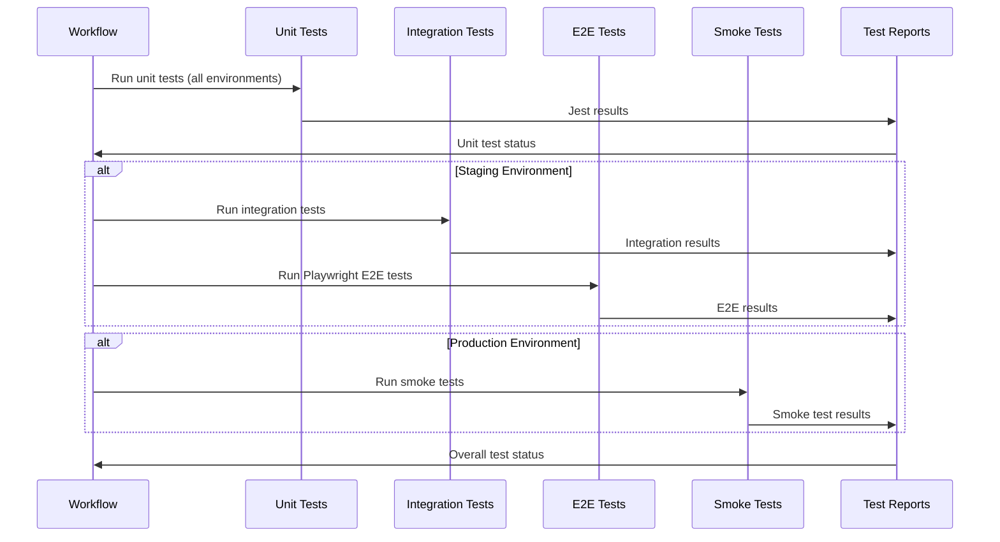

### 6. Monitoring and Notification Flow

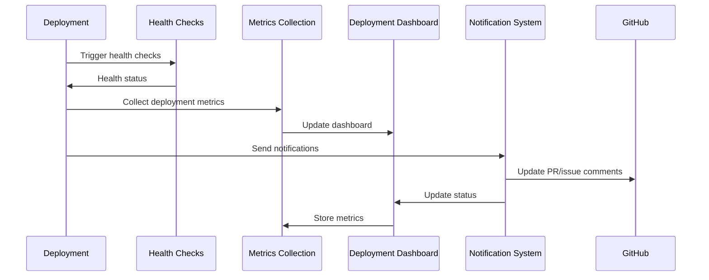

## Component Responsibilities

### GitHub Actions Workflows

| Workflow                     | Responsibility                          | Triggers                              | Outputs                       |
| ---------------------------- | --------------------------------------- | ------------------------------------- | ----------------------------- |
| **deploy.yml**               | Unified deployment for all environments | Push to staging/main, manual dispatch | Deployment status, image tags |
| **deployment-dashboard.yml** | Status monitoring and dashboard updates | Scheduled, deployment events          | Dashboard updates             |
| **deployment-metrics.yml**   | Performance analytics                   | Deployment events                     | Metrics data                  |
| **log-aggregation.yml**      | Centralized log management              | Scheduled, deployment events          | Aggregated logs               |
| **image-cleanup.yml**        | Image retention management              | Scheduled                             | Cleanup reports               |
| **dependency-check.yml**     | Dependency vulnerability scanning       | Push events, scheduled                | Security reports              |

### Reusable Actions

| Action            | Purpose                   | Inputs                             | Outputs                         |
| ----------------- | ------------------------- | ---------------------------------- | ------------------------------- |
| **deploy/**       | Unified deployment action | environment, image_tag, skip_tests | deployment_status, deployed_url |
| **health-check/** | Health verification       | environment, app_url               | health_status                   |
| **test-runner/**  | Test orchestration        | test_type, environment, app_url    | test_results, coverage          |
| **notify/**       | Notification system       | event_type, environment, details   | notification_status             |

### Infrastructure Components

| Component                 | Environment | Purpose                     | Key Tasks                                    |
| ------------------------- | ----------- | --------------------------- | -------------------------------------------- |
| **Terraform**             | All         | Infrastructure provisioning | Provision droplets, networks, firewalls      |
| **Ansible**               | All         | Application deployment      | Deploy Docker containers, configure services |
| **DigitalOcean Droplets** | All         | Compute resources           | Host application containers                  |

### Monitoring Components

| Component              | Purpose              | Metrics                       | Alerts                      |
| ---------------------- | -------------------- | ----------------------------- | --------------------------- |
| **Health Checks**      | Service availability | Uptime, response time         | Service down, slow response |
| **Deployment Metrics** | Performance tracking | Deployment time, success rate | Failed deployments          |
| **Log Aggregation**    | Centralized logging  | Error rates, patterns         | Critical errors             |

## Data Flow Patterns

### 1. Deployment Data Flow

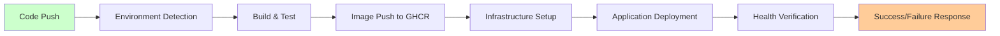

### 2. Environment Detection Flow

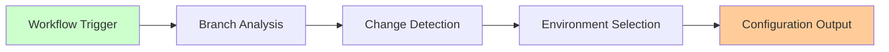

### 3. Image Management Flow

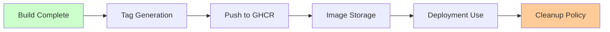

## Integration Points

### External Systems

| System                  | Integration Method | Purpose               | Data Exchanged                 |
| ----------------------- | ------------------ | --------------------- | ------------------------------ |
| **GitHub**              | Webhooks, API      | Source control, CI/CD | Code changes, workflow status  |
| **GHCR**                | Docker API         | Image storage         | Image push/pull, metadata      |
| **DigitalOcean**        | API, SSH           | Infrastructure        | Droplet management, deployment |
| **GitHub Environments** | API                | Deployment protection | Approval gates, secrets        |

### Internal Dependencies

| Component         | Depends On            | Purpose               | Critical Path |
| ----------------- | --------------------- | --------------------- | ------------- |
| **Deployment**    | Environment Detection | Determine target      | Yes           |
| **Deployment**    | Build & Test          | Image availability    | Yes           |
| **Deployment**    | Infrastructure Setup  | Resource availability | Yes           |
| **Health Checks** | Deployment            | Verify success        | Yes           |
| **Notifications** | All stages            | Status updates        | No            |

## Error Handling and Recovery

### Failure Scenarios

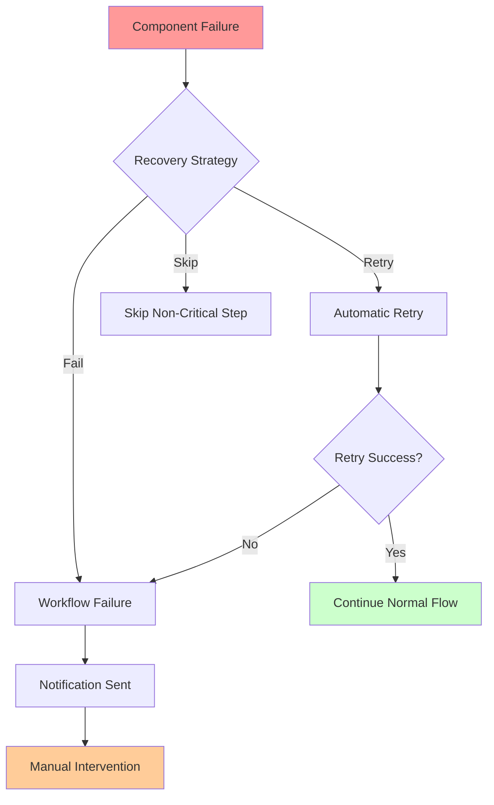

### Recovery Mechanisms

1. **Automatic Retry**: Transient failures with exponential backoff
2. **Graceful Degradation**: Skip non-critical steps when possible
3. **Manual Override**: Human intervention for complex failures
4. **Rollback Capability**: Deploy previous image version if needed

## Performance Characteristics

### Latency Expectations

| Operation              | Expected Time | Timeout    | Recovery Time |
| ---------------------- | ------------- | ---------- | ------------- |
| Environment Detection  | < 10 seconds  | 30 seconds | Immediate     |
| Build & Test           | 5-8 minutes   | 15 minutes | 2-3 minutes   |
| Infrastructure Setup   | 2-4 minutes   | 10 minutes | 1-2 minutes   |
| Application Deployment | 3-5 minutes   | 10 minutes | 2-3 minutes   |
| Health Check           | 30 seconds    | 2 minutes  | Immediate     |

### Throughput Considerations

- **Concurrent Deployments**: Maximum 1 deployment per environment at a time
- **Build Rate**: Maximum 1 build per branch per push
- **Cleanup Operations**: Maximum 1 cleanup per hour

## Security Considerations

### Access Control

| Component               | Access Level | Authentication        | Authorization                |
| ----------------------- | ------------ | --------------------- | ---------------------------- |
| **GitHub Actions**      | Repository   | GitHub Token          | Workflow permissions         |
| **GHCR Registry**       | Package      | Personal Access Token | Package permissions          |
| **Infrastructure**      | Server       | SSH Keys              | User/role-based              |
| **GitHub Environments** | Environment  | GitHub Token          | Environment protection rules |

### Data Protection

- **Image Signing**: Verify image integrity before deployment
- **Secrets Management**: Use GitHub Secrets for sensitive data
- **Network Security**: Secure communication between components
- **Audit Logging**: Track all deployment activities

## Monitoring and Observability

### Key Metrics

```yaml
critical_metrics:
  deployment_success_rate: "> 95%"
  deployment_time: "< 10 minutes"
  environment_detection_time: "< 10 seconds"
  health_check_pass_rate: "> 99%"
  image_build_time: "< 8 minutes"

alerting_rules:
  - name: "High Deployment Failure Rate"
    condition: "deployment_success_rate < 90%"
    severity: "critical"

  - name: "Slow Deployments"
    condition: "deployment_time > 15 minutes"
    severity: "warning"

  - name: "Health Check Failures"
    condition: "health_check_pass_rate < 95%"
    severity: "critical"
```

### Logging Strategy

- **Structured Logging**: JSON format for machine parsing
- **Log Levels**: DEBUG, INFO, WARN, ERROR, CRITICAL
- **Log Retention**: 30 days for operational logs, 1 year for audit logs
- **Centralized Collection**: Aggregate logs from all components via `log-aggregation.yml`

---

**Last Updated**: Documentation reflects current unified workflow implementation.
