# Component Interaction Diagram for Image Promotion System

## Overview

This document provides a comprehensive view of how all components in the new image promotion system interact with each other, showing data flow, triggers, and dependencies between different parts of the system.

## System Architecture Overview


## Detailed Component Interactions

### 1. Image Promotion Flow

```mermaid
sequenceDiagram
    participant Dev as Developer
    participant GH as GitHub
    participant GA as GitHub Actions
    participant GHCR as GHCR Registry
    participant Staging as Staging Environment
    participant Prod as Production Environment
    participant Ansible as Ansible Playbooks
    participant Monitor as Monitoring System
    
    Dev->>GH: Push to staging branch
    GH->>GA: Trigger staging workflow
    GA->>GHCR: Build and push :staging image
    GA->>Staging: Deploy staging image
    GA->>Monitor: Run health checks and tests
    
    alt Tests Pass
        GA->>GHCR: Copy :staging → :main
        GA->>Prod: Deploy promoted image
        GA->>Monitor: Verify production health
        Monitor->>GA: Health check results
        
        alt Production Healthy
            GA->>GHCR: Update :latest tag
            Monitor->>GA: Deployment successful
        else Production Unhealthy
            Monitor->>GA: Health check failed
            GA->>Prod: Trigger automatic rollback
        end
    else Tests Fail
        Monitor->>GA: Test failure
        GA->>Dev: Notify deployment failure
    end
```



### 2. Rollback Process Flow


### 3. Cleanup and Retention Flow


## Component Responsibilities

### GitHub Actions Workflows

| Workflow | Responsibility | Triggers | Outputs |
|----------|----------------|----------|---------|
| **Staging** | Build and deploy to staging | Push to staging branch | Staging deployment status |
| **Image Promotion** | Promote tested images | Staging success | Production image ready |
| **Production** | Deploy to production | Image promotion success | Production deployment status |
| **Cleanup** | Manage image retention | Daily schedule | Storage usage report |
| **Rollback** | Handle production rollbacks | Health check failures | Rollback status |

### Ansible Playbooks

| Playbook | Environment | Purpose | Key Tasks |
|----------|-------------|---------|-----------|
| **Staging** | Staging | Deploy and test | Pull image, deploy, run tests |
| **Production** | Production | Deploy promoted images | Pull promoted image, deploy, verify |
| **Rollback** | Production | Handle rollbacks | Stop services, deploy rollback, verify |

### Monitoring Components

| Component | Purpose | Metrics | Alerts |
|-----------|---------|---------|--------|
| **Health Checks** | Service availability | Uptime, response time | Service down, slow response |
| **Prometheus** | Performance metrics | CPU, memory, errors | Resource limits, error rates |
| **Alert Manager** | Alert routing | Alert frequency, resolution time | Critical alerts, alert storms |

## Data Flow Patterns

### 1. Image Promotion Data Flow


### 2. Rollback Data Flow


### 3. Cleanup Data Flow


## Integration Points

### External Systems

| System | Integration Method | Purpose | Data Exchanged |
|---------|-------------------|---------|----------------|
| **GitHub** | Webhooks, API | Source control, CI/CD | Code changes, workflow status |
| **GHCR** | Docker API | Image storage | Image push/pull, metadata |
| **DigitalOcean** | API, SSH | Infrastructure | Droplet management, deployment |
| **Slack** | Webhooks | Notifications | Deployment status, alerts |

### Internal Dependencies

| Component | Depends On | Purpose | Critical Path |
|-----------|------------|---------|---------------|
| **Image Promotion** | Staging Success | Trigger promotion | Yes |
| **Production Deploy** | Image Promotion | Use promoted image | Yes |
| **Rollback System** | Health Monitoring | Detect failures | Yes |
| **Cleanup Workflow** | Storage Monitoring | Manage retention | No |

## Error Handling and Recovery

### Failure Scenarios


### Recovery Mechanisms

1. **Automatic Retry**: Transient failures with exponential backoff
2. **Circuit Breaker**: Prevent cascading failures
3. **Graceful Degradation**: Reduce functionality instead of complete failure
4. **Manual Override**: Human intervention for complex failures

## Performance Characteristics

### Latency Expectations

| Operation | Expected Time | Timeout | Recovery Time |
|-----------|---------------|---------|---------------|
| Image Build | 5-8 minutes | 15 minutes | 2-3 minutes |
| Image Promotion | 2-3 minutes | 10 minutes | 1-2 minutes |
| Production Deploy | 3-5 minutes | 10 minutes | 2-3 minutes |
| Rollback | 2-4 minutes | 8 minutes | 1-2 minutes |
| Health Check | 30 seconds | 2 minutes | Immediate |

### Throughput Considerations

- **Concurrent Deployments**: Maximum 2 simultaneous deployments
- **Image Promotion Rate**: Maximum 1 promotion per 5 minutes
- **Rollback Frequency**: Maximum 3 rollbacks per hour
- **Cleanup Operations**: Maximum 1 cleanup per hour

## Security Considerations

### Access Control

| Component | Access Level | Authentication | Authorization |
|-----------|--------------|----------------|---------------|
| **GitHub Actions** | Repository | GitHub Token | Workflow permissions |
| **GHCR Registry** | Package | Personal Access Token | Package permissions |
| **Infrastructure** | Server | SSH Keys | User/role-based |
| **Monitoring** | Read-only | API Keys | Metric access |

### Data Protection

- **Image Signing**: Verify image integrity before promotion
- **Secrets Management**: Use GitHub Secrets for sensitive data
- **Network Security**: Secure communication between components
- **Audit Logging**: Track all promotion and rollback actions

## Monitoring and Observability

### Key Metrics

```yaml
critical_metrics:
  deployment_success_rate: "> 95%"
  rollback_frequency: "< 5 per day"
  image_promotion_time: "< 5 minutes"
  production_uptime: "> 99.9%"
  storage_usage: "< 80%"

alerting_rules:
  - name: "High Rollback Rate"
    condition: "rollback_frequency > 5 per day"
    severity: "warning"
  
  - name: "Promotion Failure"
    condition: "deployment_success_rate < 90%"
    severity: "critical"
  
  - name: "Storage Critical"
    condition: "storage_usage > 90%"
    severity: "critical"
```

### Logging Strategy

- **Structured Logging**: JSON format for machine parsing
- **Log Levels**: DEBUG, INFO, WARN, ERROR, CRITICAL
- **Log Retention**: 30 days for operational logs, 1 year for audit logs
- **Centralized Collection**: Aggregate logs from all components
