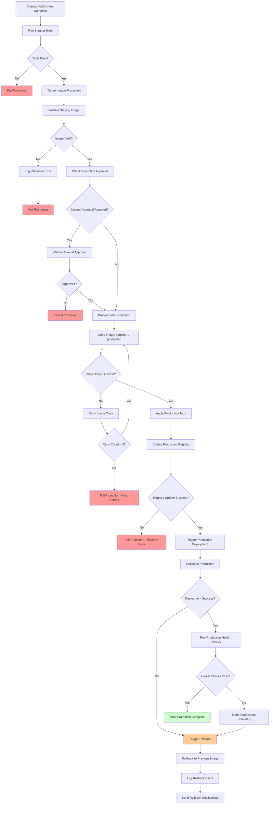
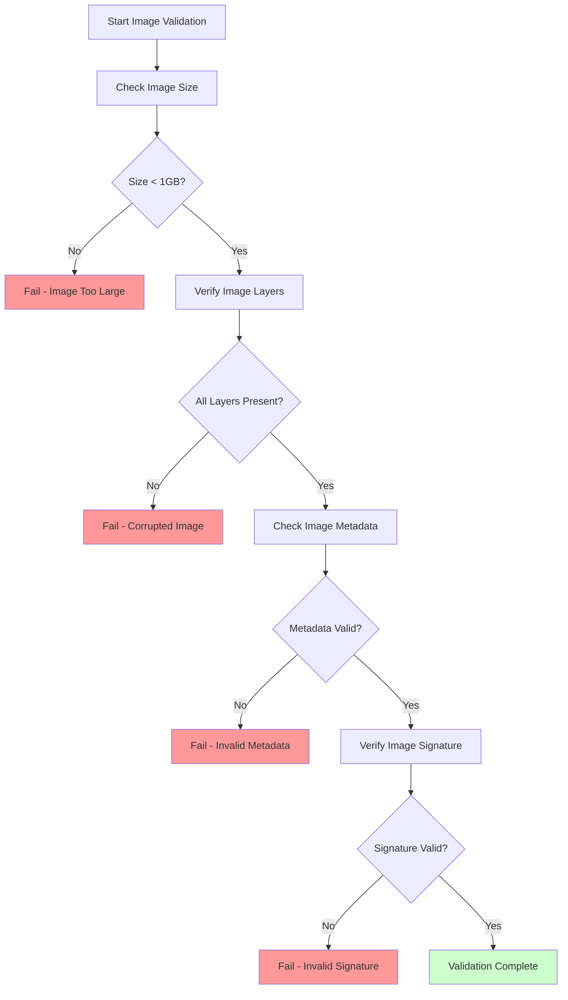
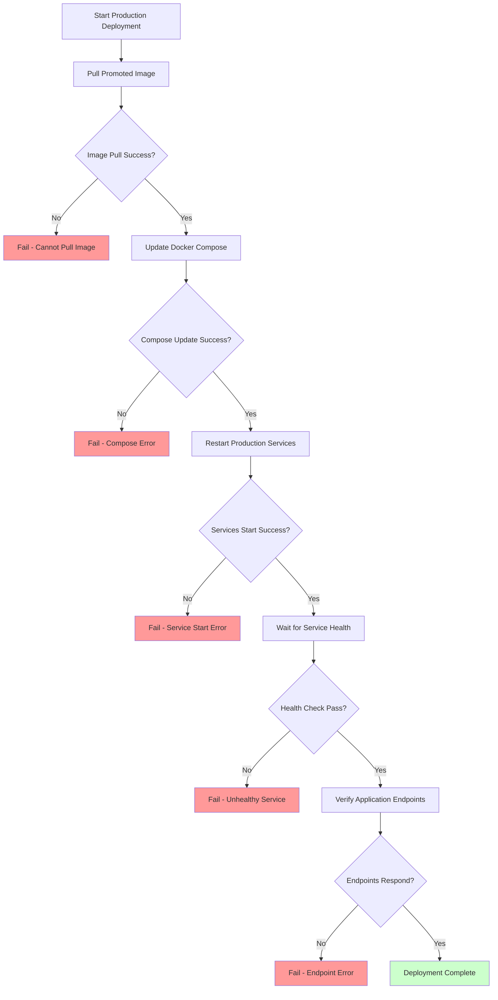
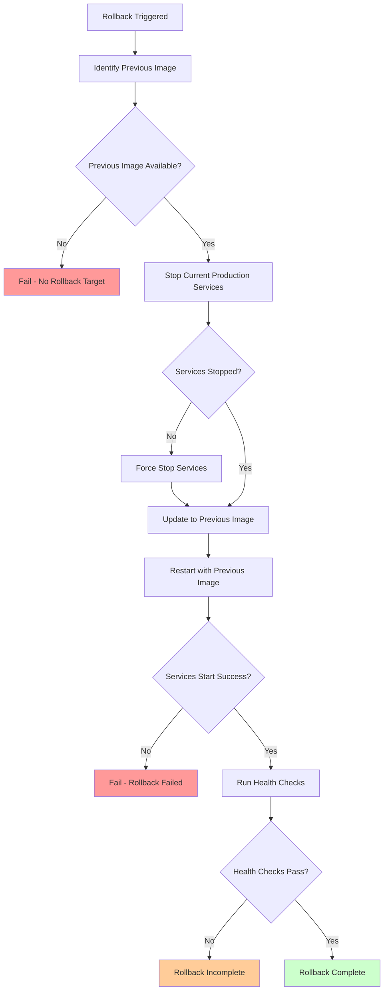

# Image Promotion Workflow

## Overview

This document details the step-by-step workflow for promoting tested staging images to production, including validation, approval, and rollback mechanisms.

## Main Promotion Workflow

## Detailed Sub-Workflows

### 1. Image Validation Process

### 2. Production Deployment Verification

### 3. Rollback Process

## Workflow States and Transitions

### Promotion States
1. **Pending** - Waiting for approval or conditions
2. **In Progress** - Promotion actively running
3. **Completed** - Successfully promoted and deployed
4. **Failed** - Promotion failed at some step
5. **Rolled Back** - Production rolled back to previous image

### Key Decision Points
- **Test Results** - Must pass all staging tests
- **Image Validation** - Image integrity and size checks
- **Approval** - Manual approval if required
- **Copy Success** - Image transfer between registries
- **Deployment Health** - Production service verification

### Error Recovery
- **Retry Logic** - Automatic retries for transient failures
- **Rollback Triggers** - Automatic rollback on critical failures
- **Notification System** - Alerts for all failure scenarios
- **Audit Logging** - Complete trail of all actions and decisions

## Integration Points

### GitHub Actions
- **Triggers**: Staging deployment success, manual promotion
- **Actions**: Image validation, registry operations, deployment orchestration
- **Outputs**: Promotion status, deployment results, rollback triggers

### Ansible Playbooks
- **Staging**: Triggers promotion workflow after successful deployment
- **Production**: Uses promoted images, handles rollback procedures
- **Verification**: Health checks, endpoint validation, service monitoring

### Monitoring and Alerting
- **Promotion Status**: Real-time updates on promotion progress
- **Deployment Health**: Continuous monitoring of production services
- **Rollback Alerts**: Immediate notification of rollback events
