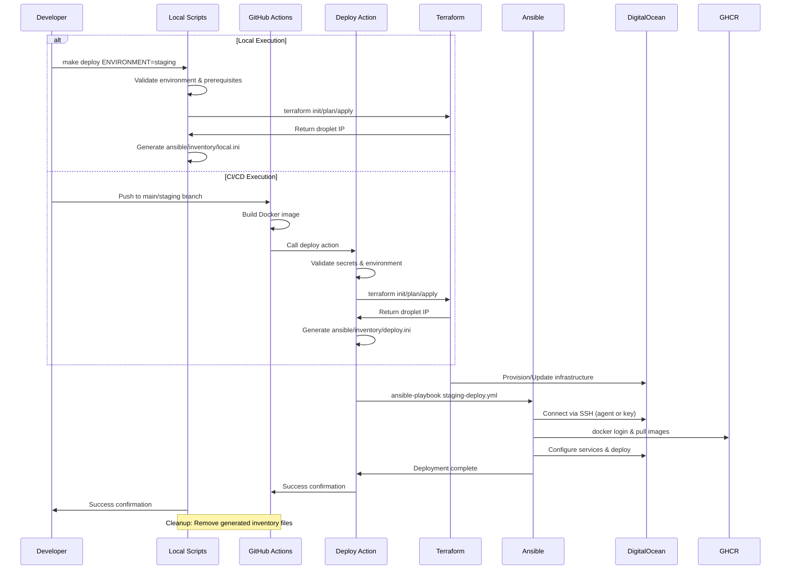

# Local Development Setup Guide

This guide enables developers to run Terraform and Ansible deployments locally when GitHub Actions workflows fail, providing a backup execution path while maintaining environment parity with CI/CD.

## Prerequisites

### Required Tools

Install the following tools on your local development machine:

#### Terraform >= 1.5.0

```bash
# Download from https://www.terraform.io/downloads
# Or install via package manager:

# Ubuntu/Debian
wget -O- https://apt.releases.hashicorp.com/gpg | sudo gpg --dearmor -o /usr/share/keyrings/hashicorp-archive-keyring.gpg
echo "deb [signed-by=/usr/share/keyrings/hashicorp-archive-keyring.gpg] https://apt.releases.hashicorp.com jammy main" | sudo tee /etc/apt/sources.list.d/hashicorp.list
sudo apt update && sudo apt install terraform

# macOS
brew tap hashicorp/tap
brew install hashicorp/tap/terraform

# Verify installation
terraform --version
```

#### Ansible

```bash
# Install Ansible
pip install ansible

# Install required Ansible collections
ansible-galaxy collection install community.general
ansible-galaxy collection install community.docker

# Verify installation
ansible --version
```

#### DigitalOcean CLI (doctl)

```bash
# Download and install doctl
# Linux
wget https://github.com/digitalocean/doctl/releases/download/v1.104.0/doctl-1.104.0-linux-amd64.tar.gz
tar xf doctl-1.104.0-linux-amd64.tar.gz
sudo mv doctl /usr/local/bin

# macOS
brew install doctl

# Authenticate
doctl auth init
doctl account get

# Verify installation
doctl version
```

#### AWS CLI (for DigitalOcean Spaces access)

```bash
# Install AWS CLI
pip install awscli

# Configure for DigitalOcean Spaces
# Note: Use your DigitalOcean Spaces access keys, not regular AWS credentials
aws configure
# AWS Access Key ID: Your Spaces access key
# AWS Secret Access Key: Your Spaces secret key
# Default region: us-east-1 (or your preferred region)
# Default output format: json

# Verify installation
aws --version
```

#### Docker

```bash
# Install Docker Desktop or Docker Engine
# Follow instructions for your platform: https://docs.docker.com/get-docker/

# Verify installation
docker --version
docker run hello-world
```

#### SSH Agent Setup

```bash
# Ensure SSH agent is running
eval "$(ssh-agent -s)"

# Add your SSH key (replace with your key path)
ssh-add ~/.ssh/id_ed25519

# Verify SSH agent has keys
ssh-add -l
```

#### DigitalOcean Spaces Access for Terraform State

The Terraform configuration uses DigitalOcean Spaces for remote state storage. Ensure you have access to the Spaces bucket:

```bash
# Configure Spaces access (uses same credentials as DO_TOKEN)
# The Spaces access keys should be configured in your DigitalOcean account
# and accessible via the DO_TOKEN

# Test Spaces access using AWS CLI (recommended)
aws s3 ls --endpoint-url https://tor1.digitaloceanspaces.com

# Or test using curl with DigitalOcean API
curl -H "Authorization: Bearer $DO_TOKEN" https://api.digitalocean.com/v2/spaces

# Verify the terraform state bucket exists using AWS CLI
aws s3 ls s3://bxtf --endpoint-url https://tor1.digitaloceanspaces.com
```

**Important**: Your DigitalOcean token must have Spaces access permissions to read/write the Terraform state file.

## Environment Variables Setup

### Required Environment Variables

Create a `.env.local` file in the project root (this file is gitignored) and set these environment variables:

```bash
# DigitalOcean API Access
DO_TOKEN=your_digitalocean_api_token_here

# DigitalOcean Spaces Access (for Terraform state)
AWS_ACCESS_KEY_ID=your_spaces_access_key_here
AWS_SECRET_ACCESS_KEY=your_spaces_secret_key_here

# SSH Configuration (uses SSH agent)
SSH_KEY_FINGERPRINT=your_ssh_key_fingerprint_here  # Optional: if multiple keys

# Application Secrets
BREVO_API_KEY=your_brevo_api_key_here
STRIPE_SECRET_KEY=your_stripe_secret_key_here
STRIPE_PUBLISHABLE_KEY=your_stripe_publishable_key_here
GA_STAGING_ID=G-XXXXXXXXXX  # Google Analytics staging
GA_PRODUCTION_ID=G-XXXXXXXXXX  # Google Analytics production

# Optional: Override defaults
DOCKER_IMAGE=ghcr.io/yourusername/dotca:custom-tag
ANSIBLE_VAULT_PASSWORD=your_vault_password_if_using_encrypted_vars
```

**Note**: The `.env.local` file is automatically loaded by the local execution scripts. Do not commit this file to version control.

### Getting Your DigitalOcean Token

1. Go to [DigitalOcean Dashboard](https://cloud.digitalocean.com/account/api/tokens)
2. Generate a new Personal Access Token with read/write permissions
3. Copy the token and set it as `DO_TOKEN`

### Getting Your DigitalOcean Spaces Credentials

1. Go to [DigitalOcean Dashboard](https://cloud.digitalocean.com/account/api/tokens)
2. Under "Spaces Keys" section, generate a new Spaces access key
3. Copy the Access Key and Secret Key
4. Set them as `AWS_ACCESS_KEY_ID` and `AWS_SECRET_ACCESS_KEY` respectively

**Note**: Spaces access keys are separate from regular API tokens and are specifically for object storage access.

### Getting SSH Key Fingerprint

```bash
# If you have multiple SSH keys, get the fingerprint
ssh-keygen -l -E md5 -f ~/.ssh/your_key_file

# Or use doctl to list your keys
doctl compute ssh-key list
```

## SSH Key Management

### SSH Agent Integration

The local setup uses your system's SSH agent for authentication, providing seamless integration with your existing SSH key management:

```bash
# Check SSH agent status
ssh-add -l

# Add key if not present
ssh-add ~/.ssh/your_private_key

# Test connection to a droplet (replace IP)
ssh -o StrictHostKeyChecking=no root@YOUR_DROPLET_IP "echo 'SSH connection successful'"
```

### DigitalOcean SSH Key Association

Ensure your SSH public key is associated with your DigitalOcean account:

```bash
# Import your public key to DigitalOcean
doctl compute ssh-key create my-local-key --public-key "$(cat ~/.ssh/id_ed25519.pub)"

# List your SSH keys
doctl compute ssh-key list

# Note the fingerprint for use in Terraform variables
```

### SSH Key Security Best Practices

- Use Ed25519 keys (more secure than RSA)
- Protect private keys with strong passphrases
- Never commit private keys to version control
- Regularly rotate SSH keys
- Use SSH agent forwarding when needed

## Architecture Overview

### Component Architecture


### Dynamic Inventory Management

The system uses **dynamic Ansible inventory generation** to ensure deployments work seamlessly across different environments and infrastructure instances.

#### Inventory Template Structure

The `ansible/inventory/local.ini` file serves as a **template and documentation file**:

```ini
# Local Ansible inventory for dotca deployments
# This file is generated dynamically by deployment scripts
# Do not edit manually - it will be overwritten

[digitalocean]
# Host entries will be added here by deployment scripts
# Example: dotca-staging ansible_host=147.182.159.169

[digitalocean:vars]
# Common variables for DigitalOcean droplets
ansible_user=root
ansible_python_interpreter=/usr/bin/python3
ansible_ssh_common_args='-o StrictHostKeyChecking=no -o UserKnownHostsFile=/dev/null'
project_name=dotca-nextjs
app_dir=/app

# Environment-specific variables will be added here by deployment scripts
```

#### Runtime Inventory Generation

Both **local scripts** and **GitHub Actions** generate inventory files dynamically during deployment:

**Local Deployment:**

```bash
# Script gets real droplet IP from Terraform
DROPLET_IP=$(terraform output -raw droplet_ip)

# Generates inventory with actual values
cat > ansible/inventory/local.ini << EOF
[digitalocean]
dotca-staging ansible_host=$DROPLET_IP

[digitalocean:vars]
# ... actual configuration values
environment=staging
docker_image=ghcr.io/bxmty/dotca:staging
staging_domain=staging.boximity.ca
EOF
```

**GitHub Actions:**

```yaml
# Action generates inventory with Terraform outputs
cat > ansible/inventory/deploy.ini << EOF
[digitalocean]
dotca-production ansible_host=$DROPLET_IP
# ... production-specific configuration
EOF
```

#### Key Benefits

- **🚀 Environment Agnostic**: Works with any droplet IP (staging/production/new instances)
- **🔄 Dynamic Adaptation**: Automatically adapts to infrastructure changes
- **🧹 Automatic Cleanup**: Generated files removed after deployment
- **🔒 Security**: No sensitive data committed to version control
- **📋 Consistency**: Same inventory structure locally and in CI/CD

### Deployment Flow



## Local vs CI/CD Execution Differences

### Environment Parity

| Aspect                 | Local Execution       | CI/CD Execution    | Notes                                 |
| ---------------------- | --------------------- | ------------------ | ------------------------------------- |
| **Terraform Version**  | User-installed        | Pinned in workflow | Ensure local version >= 1.5.0         |
| **Ansible Version**    | User-installed        | Pinned in workflow | Compatible versions required          |
| **SSH Authentication** | SSH Agent             | Private key file   | Local uses agent, CI/CD uses secrets  |
| **Remote State**       | Same S3 backend       | Same S3 backend    | Shared state management               |
| **Secrets Management** | Environment variables | GitHub Secrets     | Same secret values, different access  |
| **Docker Registry**    | User authentication   | GITHUB_TOKEN       | Same registry, different auth methods |
| **Network Access**     | Developer network     | GitHub runners     | Firewall rules may differ             |

### Key Differences to Note

1. **SSH Authentication Method**:
   - Local: Uses SSH agent with developer's keys
   - CI/CD: Uses private key from GitHub secrets

2. **Registry Authentication**:
   - Local: Requires personal access token
   - CI/CD: Uses GITHUB_TOKEN automatically

3. **Network Restrictions**:
   - Local: May be behind corporate firewalls
   - CI/CD: GitHub runners have different network access

4. **Resource Limits**:
   - Local: Limited by developer machine
   - CI/CD: Consistent runner specifications

## Quick Start Workflow

### Initial Setup

```bash
# 1. Clone and setup project
git clone <repository-url>
cd dotca

# 2. Install prerequisites (see Prerequisites section above)

# 3. Run initial setup (automates environment configuration)
make setup

# 4. Edit .env.local with your actual values
# The setup script creates a template - fill in your real values
nano .env.local

# 5. Validate setup
make validate

# 6. Test deployment (dry-run first)
make deploy ENVIRONMENT=staging DRY_RUN=true
```

### Common Operations

```bash
# Full deployment to staging
make deploy ENVIRONMENT=staging

# Deploy to production (with confirmation)
make deploy ENVIRONMENT=production

# Check environment status
make status ENVIRONMENT=staging

# Destroy environment (with confirmation)
make destroy ENVIRONMENT=staging

# Get help
make help
```

### Available Commands

The Makefile provides these high-level commands:

- `make setup` - Initial environment setup and configuration
- `make validate` - **Comprehensive environment validation** (see below)
- `make deploy ENVIRONMENT=staging` - Deploy to specified environment
- `make destroy ENVIRONMENT=staging` - Destroy environment (dangerous!)
- `make status ENVIRONMENT=staging` - Check environment status
- `make clean` - Clean up generated files
- `make test` - Run all validations

### Environment Validation Checks

The `make validate` command performs comprehensive validation of:

**🔧 Tools & Versions:**

- Terraform ≥ 1.5.0, Ansible, DigitalOcean CLI, AWS CLI, Docker, SSH, Git, Python 3

**🔑 SSH & Authentication:**

- SSH agent running and keys loaded
- SSH key file accessibility and format

**🔐 Environment Variables:**

- Required secrets (DO_TOKEN, API keys) present and valid
- Optional variables checked with warnings

**☁️ DigitalOcean Access:**

- API connectivity and authentication
- Spaces access for Terraform state storage
- SSH keys available in account

**🏗️ Infrastructure Setup:**

- Terraform configuration files present
- Ansible playbooks and configuration
- Project directory structure

**📋 Validation Results:**

- Clear pass/fail status with detailed error messages
- Actionable suggestions for fixing issues
- Comprehensive report of all checks

### Direct Script Usage

You can also use the scripts directly:

```bash
# Deploy using script directly
./scripts/local-deploy.sh staging --dry-run

# Setup using script directly
./scripts/setup-local-dev.sh --verbose

# Destroy using script directly
./scripts/local-destroy.sh staging --force
```

## Troubleshooting

### Common Issues and Solutions

#### SSH Connection Issues

**Error**: `Permission denied (publickey)`

```bash
# Check SSH agent has keys
ssh-add -l

# Add key if missing
ssh-add ~/.ssh/your_private_key

# Test connection manually
ssh -o StrictHostKeyChecking=no root@DROPLET_IP "echo 'Connection test'"

# Check SSH key fingerprint matches DigitalOcean
doctl compute ssh-key list
```

**Error**: `SSH agent not running`

```bash
# Start SSH agent
eval "$(ssh-agent -s)"

# Add your key
ssh-add ~/.ssh/your_private_key
```

#### Terraform Issues

**Error**: `Error acquiring the state lock`

```bash
# Check if another process is running Terraform
# Wait for CI/CD workflows to complete
# Force unlock if necessary (dangerous!)
terraform force-unlock LOCK_ID
```

**Error**: `DigitalOcean token not valid`

```bash
# Check token is set
echo $DO_TOKEN | head -c 10  # Should show start of token

# Test token with doctl
doctl account get

# Regenerate token if needed
# https://cloud.digitalocean.com/account/api/tokens
```

#### Ansible Issues

**Error**: `Failed to connect to the host via ssh`

```bash
# Check droplet IP is correct
ping DROPLET_IP

# Test SSH connection manually
ssh root@DROPLET_IP

# Check firewall rules
doctl compute firewall list
```

**Error**: `Docker login failed`

```bash
# Check GITHUB_TOKEN is set
echo $GITHUB_TOKEN | wc -c  # Should be > 0

# Test manual login
echo $GITHUB_TOKEN | docker login ghcr.io -u YOUR_USERNAME --password-stdin

# Check token permissions
# https://github.com/settings/tokens
```

#### Docker Issues

**Error**: `Image not found`

```bash
# Check image exists in registry
docker search ghcr.io/yourusername/dotca

# Pull manually
docker pull ghcr.io/yourusername/dotca:staging

# Check registry permissions
```

### Debugging Commands

```bash
# Check all prerequisites
make validate

# Test Terraform connectivity
cd terraform && terraform init && terraform plan

# Test Ansible connectivity
ansible -i ansible/inventory/inventory.ini digitalocean -m ping

# Check Docker registry access
docker login ghcr.io
docker pull ghcr.io/yourusername/dotca:staging

# Test SSH connection
ssh -v root@DROPLET_IP

# Check DigitalOcean API access
doctl account get
doctl compute droplet list
```

#### Ansible Inventory Issues

**Problem**: Manual edits to `ansible/inventory/local.ini` get overwritten

**Solution**: The `local.ini` file is a **dynamic template** that gets regenerated during each deployment with real infrastructure values (droplet IPs, environment variables). Do not manually edit this file - it will be overwritten.

**Manual Inventory Testing**:

```bash
# Test Ansible connectivity without deployment
make ansible-ping ENVIRONMENT=staging

# Check inventory syntax
make ansible-syntax
```

**Debugging Inventory Generation**:

```bash
# Run deployment with verbose output to see inventory creation
make deploy ENVIRONMENT=staging VERBOSE=true

# Check generated inventory after deployment
cat ansible/inventory/local.ini
```

### Getting Help

1. Check this documentation first
2. Review error messages carefully
3. Test components individually (Terraform → Ansible → Docker)
4. Compare with successful CI/CD runs
5. Check GitHub Issues for similar problems
6. Contact DevOps team for infrastructure issues

## Security Considerations

### Local Execution Security

- Never commit secrets to version control
- Use strong passphrases for SSH keys
- Regularly rotate API tokens and SSH keys
- Be cautious with `terraform destroy` operations
- Use environment-specific secrets appropriately

### Network Security

- Understand firewall rules before deployment
- Be aware of your network's restrictions
- Use VPN if required for corporate networks
- Monitor resource usage and costs

### Best Practices

- Always test with `DRY_RUN=true` first
- Review Terraform plans before applying
- Keep local and CI/CD environments in sync
- Document any local changes for team knowledge
- Use version control for infrastructure changes

## Related Documentation

- [GitHub Actions Workflow Documentation](../.github/workflows/README.md)
- [Ansible Playbook Documentation](../ansible/README.md)
- [Terraform Infrastructure Documentation](../terraform/README.md)
- [Secrets Management Guide](../docs/SECRETS_ROTATION_GUIDE.md)
- [SSH Key Management Guide](../docs/SSH_KEY_MANAGEMENT.md)

---

**Last Updated**: December 2025
**Version**: 1.0
**Authors**: DevOps Team
